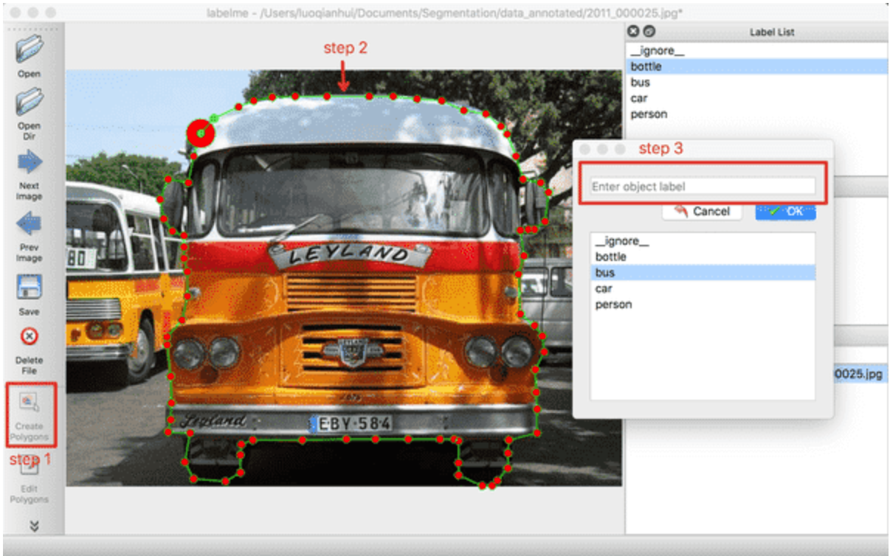
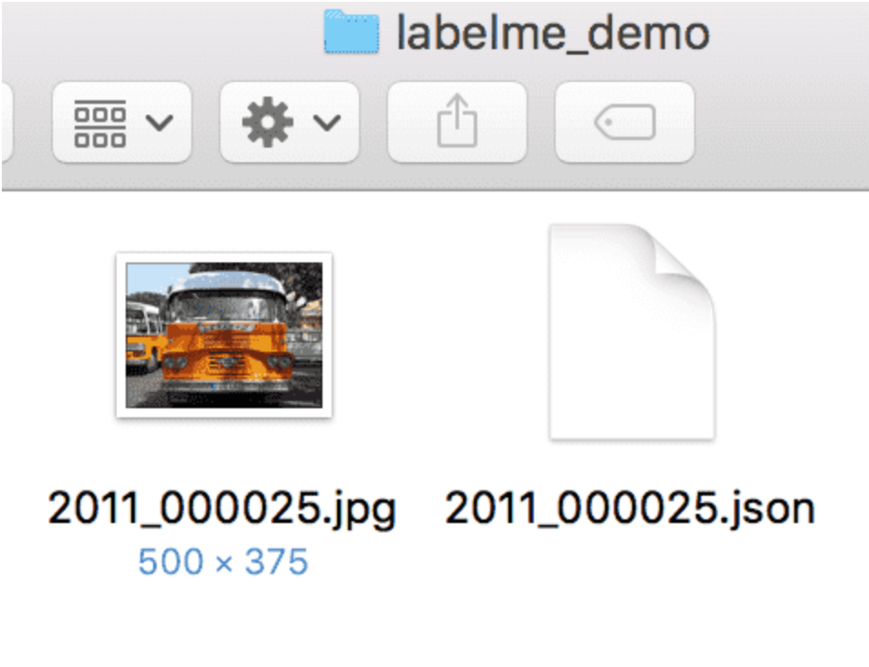

# 概述
本文重点介绍如何利用飞桨图像分割套件**PaddleSeg**在视盘分割数据上，使用当前PaddleSeg主推的PP-LiteSeg模型进行详细讲解
PP-LiteSeg模型是PaddleSeg团队自研的轻量级语义分割模型，模型结构如下。

PP-LiteSeg模型更详细的原理介绍请参考[官网链接](https://github.com/PaddlePaddle/PaddleSeg)。

## 文章目录结构
- 1 环境安装
  - 1.1 PaddlePaddle安装
    - 1.1.1 安装对应版本PaddlePaddle
    - 1.1.2 验证安装是否成功
  - 1.2 PaddleSeg安装
    - 1.2.1 下载PaddleSeg代码
    - 1.2.2 安装依赖项目
    - 1.2.3 验证安装是否成功
- 2 数据准备
  - 2.1 数据标注
    - 2.1.1 LabelMe安装
    - 2.1.2 LabelMe的使用
  - 2.2 数据格式转化
  - 2.3 数据划分
- 3 模型训练、验证与预测
  - 3.1 模型训练参数说明
    - 3.1.1 训练前数据准备
    - 3.1.2 开始训练
    - 3.1.3 训练参数解释
    - 3.1.4 恢复训练
    - 3.1.5 训练可视化
  - 3.2 模型验证参数说明
    - 3.2.1 评估操作
    - 3.2.2 评估方式说明
  - 3.3 模型预测
    - 3.3.1 准备预测数据
    - 3.3.2 输出文件说明
    - 3.3.3 自定义color map
- 4 配置文件的说明
  - 4.1 整体配置文件格式综述
  - 4.2 数据路径与数据预处理说明
  - 4.3 模型与主干网络说明
  - 4.4 优化器和损失函数说明
  - 4.5 其它参数说明

# 1 环境安装

## 1.1 PaddlePaddle安装

### 1.1.1 安装对应版本PaddlePaddle
根据系统和设备的cuda环境，选择对应的安装包，这里默认使用pip在linux设备上进行安装。

在终端执行

```bash
pip install paddlepaddle-gpu==2.3.0.post110 -f https://www.paddlepaddle.org.cn/whl/linux/mkl/avx/stable.html
```

### 1.1.2 验证安装是否成功

``` bash
# 安装完成后您可以使用 python进入python解释器，
python
# 继续输入
import paddle 
# 再输入 
paddle.utils.run_check()
```
如果出现PaddlePaddle is installed successfully!，说明您已成功安装。

## 1.2 PaddleSeg安装

### 1.2.1 下载PaddleSeg代码
用户可以通过使用github或者gitee的方式进行下载，我们当前版本为PaddleSeg的release v2.5版本。后续在使用时，需要对应版本进行下载。


``` bash
# github下载
git clone -b release/2.5 https://github.com/PaddlePaddle/PaddleSeg.git
# gitee下载
git clone -b release/2.5 https://gitee.com/PaddlePaddle/PaddleSeg.git
```

### 1.2.2 安装依赖项目
* 方式一：
通过直接pip install 安装，可以最高效率的安装依赖
``` bash
pip install paddleseg
```
* 方式二：
下载PaddleSeg代码后，进入PaddleSeg代码文件夹目录下面
``` bash
cd PaddleSeg
pip install -r requirements.txt
```

### 1.2.3 验证安装是否成功
在PaddleSeg目录下执行如下命令，会进行简单的单卡训练和单卡预测。

查看执行输出的log，没有报错，则验证安装成功。
``` bash
sh tests/run_check_install.sh
```

# 2 数据准备

## 2.1 数据标注

无论是语义分割，全景分割，还是实例分割，我们都需要充足的训练数据。如果你想使用没有标注的原始数据集做分割任务，你必须先为原始图像作出标注。

### 2.1.1 LabelMe安装


用户在采集完用于训练、评估和预测的图片之后，需使用数据标注工具[LabelMe](https://github.com/wkentaro/labelme)完成数据标注。

LabelMe支持在Windows/macOS/Linux三个系统上使用，且三个系统下的标注格式是一样。具体的安装流程请参见[官方安装指南](https://github.com/wkentaro/labelme)。

### 2.1.2 LabelMe的使用

打开终端输入`labelme`会出现LableMe的交互界面，可以先预览`LabelMe`给出的已标注好的图片，再开始标注自定义数据集。


<div align="center">
    <p>图1 LableMe交互界面的示意图</p>
 </div>


   * 预览已标注图片  

获取`LabelMe`的源码：

```bash
git clone https://github.com/wkentaro/labelme
```

终端输入`labelme`会出现LableMe的交互界面，点击`OpenDir`打开`<path/to/labelme>/examples/semantic_segmentation/data_annotated`，其中`<path/to/labelme>`为克隆下来的`labelme`的路径，打开后示意的是语义分割的真值标注。


<div align="center">
    <p>图2 已标注图片的示意图</p>
 </div>


   * 开始标注

请按照下述步骤标注数据集：

​        (1)   点击`OpenDir`打开待标注图片所在目录，点击`Create Polygons`，沿着目标的边缘画多边形，完成后输入目标的类别。在标注过程中，如果某个点画错了，可以按撤销快捷键可撤销该点。Mac下的撤销快捷键为`command+Z`。



<div align="center">
    <p>图3 标注单个目标的示意图</p>
 </div>


​        (2)   右击选择`Edit Polygons`可以整体移动多边形的位置，也可以移动某个点的位置；右击选择`Edit Label`可以修改每个目标的类别。请根据自己的需要执行这一步骤，若不需要修改，可跳过。


<div align="center">
    <p>图4 修改标注的示意图</p>
 </div>


​        (3)   图片中所有目标的标注都完成后，点击`Save`保存json文件，**请将json文件和图片放在同一个文件夹里**，点击`Next Image`标注下一张图片。

LableMe产出的真值文件可参考我们给出的[文件夹](https://github.com/PaddlePaddle/PaddleSeg/blob/release/v0.8.0/docs/annotation/labelme_demo)。




<div align="center">
    <p>图5 LableMe产出的真值文件的示意图</p>
 </div>


 **Note：**

 对于中间有空洞的目标的标注方法：在标注完目标轮廓后，再沿空洞区域边缘画多边形，并将其指定为其他类别，如果是背景则指定为`_background_`。如下：


 <div align="center">
    <p>图6 带空洞目标的标注示意图</p>
 </div>


## 2.2 数据格式转化
PaddleX做为飞桨全流程开发工具，提供了非常多的工具，在这里我们使用paddlex进行数据格式转化。
首先安装paddlex

```bash
pip install paddlex
```
目前所有标注工具生成的标注文件，均为与原图同名的json格式文件，如`1.jpg`在标注完成后，则会在标注文件保存的目录中生成`1.json`文件。转换时参照以下步骤：

1. 将所有的原图文件放在同一个目录下，如`pics`目录  
2. 将所有的标注json文件放在同一个目录下，如`annotations`目录  
3. 使用如下命令进行转换:

```bash
paddlex --data_conversion --source labelme --to SEG --pics ./pics --annotations ./annotations --save_dir ./converted_dataset_dir
```

| 参数 | 说明 |
| ---- | ---- |
| --source | 表示数据标注来源，支持`labelme`、`jingling`（分别表示数据来源于LabelMe，精灵标注助手）|
| --to | 表示数据需要转换成为的格式，支持`ImageNet`（图像分类）、`PascalVOC`（目标检测），`MSCOCO`（实例分割，也可用于目标检测）和`SEG`(语义分割)  |
| --pics | 指定原图所在的目录路径  |
| --annotations | 指定标注文件所在的目录路径 |

## 2.3 数据划分
在这里，我们依旧使用paddlex进行数据划分
使用paddlex命令即可将数据集随机划分成70%训练集，20%验证集和10%测试集:
```bash
paddlex --split_dataset --format SEG --dataset_dir ./converted_dataset_dir --val_value 0.2 --test_value 0.1
```
执行上面命令行，会在`./converted_dataset_dir`下生成`train_list.txt`, `val_list.txt`, `test_list.txt`，分别存储训练样本信息，验证样本信息，测试样本信息

至此我们的数据就创作完成了，最终我们的产出形态应如下所示
- 文件结构

        custom_dataset
        |
        |--images
        |  |--image1.jpg
        |  |--image2.jpg
        |  |--...
        |
        |--labels
        |  |--label1.png
        |  |--label2.png
        |  |--...
        |
        |--train.txt
        |
        |--val.txt
        |
        |--test.txt

- 文件夹命名为custom_dataset、images、labels不是必须，用户可以自主进行命名。

- 其中train.txt和val.txt的内容如下所示：

  ```

   images/image1.jpg labels/label1.png
   images/image2.jpg labels/label2.png
   ...
  ```
  **note**非常重要！！！

我们一般推荐用户将数据集放置在PaddleSeg下的data文件夹下，下文配置文件的修改也是按照该方式。

# 3 模型训练与验证

## 3.1模型训练参数说明

### 3.1.1 训练前准备
我们可以通过PaddleSeg提供的脚本对模型进行训练，在本小节中我们使用`PP-LiteSeg`模型与`optic_disc`数据集展示训练过程。 在训练之前，最重要的修改自己的数据情况，确保能够正常训练。

在本项目中，我们使用```configs/pp_liteseg_stdc1_cityscapes_1024x512_scale1.0_160k.yml```进行训练。

我们发现```pp_liteseg_stdc1_cityscapes_1024x512_scale1.0_160k.yml```，需要逐层依赖```pp_liteseg_stdc1_cityscapes_1024x512_scale0.5_160k.yml```和```_base_/cityscapes.yml```。

在这里改动\_base\_/cityscapes.yml中文件的路径，修改为如下内容。
```yaml
train_dataset:
  type: Dataset
  dataset_root: data/optic_disc_seg
  train_path: data/optic_disc_seg/train_list.txt
  num_classes: 2
  transforms:
    - type: ResizeStepScaling
      min_scale_factor: 0.5
      max_scale_factor: 2.0
      scale_step_size: 0.25
    - type: RandomPaddingCrop
      crop_size: [1024, 512]
    - type: RandomHorizontalFlip
    - type: RandomDistort
      brightness_range: 0.4
      contrast_range: 0.4
      saturation_range: 0.4
    - type: Normalize
  mode: train

val_dataset:
  type: Dataset
  dataset_root: data/optic_disc_seg
  val_path: data/optic_disc_seg/val_list.txt
  num_classes: 2
  transforms:
    - type: Normalize
  mode: val
```
**note**非常重要！！！

* 关键改动的配置中的路径，这一个涉及相对路径，安照提示一步步来，确保最终能够完成。

* 本次项目中使用到的数据[下载链接](https://paddleseg.bj.bcebos.com/dataset/optic_disc_seg.zip)，本章节将使用视盘分割（optic disc segmentation）数据集进行训练，视盘分割是一组眼底医疗分割数据集，包含了267张训练图片、76张验证图片、38张测试图片。

### 3.1.2 开始训练
请确保已经完成了PaddleSeg的安装工作，并且当前位于PaddleSeg目录下，执行以下脚本：
```bash
export CUDA_VISIBLE_DEVICES=0 # 设置1张可用的卡
# windows下请执行以下命令
# set CUDA_VISIBLE_DEVICES=0

python train.py \
       --config configs/pp_liteseg/pp_liteseg_stdc1_cityscapes_1024x512_scale1.0_160k.yml \
       --do_eval \
       --use_vdl \
       --save_interval 500 \
       --save_dir output
```

### 3.1.3 训练参数解释

| 参数名              | 用途                                                         | 是否必选项 | 默认值           |
| :------------------ | :----------------------------------------------------------- | :--------- | :--------------- |
| iters               | 训练迭代次数                                                 | 否         | 配置文件中指定值 |
| batch_size          | 单卡batch size                                               | 否         | 配置文件中指定值 |
| learning_rate       | 初始学习率                                                   | 否         | 配置文件中指定值 |
| config              | 配置文件                                                     | 是         | -                |
| save_dir            | 模型和visualdl日志文件的保存根路径                           | 否         | output           |
| num_workers         | 用于异步读取数据的进程数量， 大于等于1时开启子进程读取数据   | 否         | 0                |
| use_vdl             | 是否开启visualdl记录训练数据                                 | 否         | 否               |
| save_interval       | 模型保存的间隔步数                                           | 否         | 1000             |
| do_eval             | 是否在保存模型时启动评估, 启动时将会根据mIoU保存最佳模型至best_model | 否         | 否               |
| log_iters           | 打印日志的间隔步数                                           | 否         | 10               |
| resume_model        | 恢复训练模型路径，如：`output/iter_1000`                     | 否         | None             |
| keep_checkpoint_max | 最新模型保存个数                                             | 否         | 5                |

### 3.1.3 多卡训练
如果想要使用多卡训练的话，需要将环境变量CUDA_VISIBLE_DEVICES指定为多卡（不指定时默认使用所有的gpu)，并使用paddle.distributed.launch启动训练脚本（windows下由于不支持nccl，无法使用多卡训练）:

```bash
export CUDA_VISIBLE_DEVICES=0,1,2,3 # 设置4张可用的卡
python -m paddle.distributed.launch train.py \
       --config configs/pp_liteseg/pp_liteseg_stdc1_cityscapes_1024x512_scale1.0_160k.yml  \
       --do_eval \
       --use_vdl \
       --save_interval 500 \
       --save_dir output
```

### 3.1.4 恢复训练
```bash
python train.py \
       --config configs/pp_liteseg/pp_liteseg_stdc1_cityscapes_1024x512_scale1.0_160k.yml \
       --resume_model output/iter_500 \
       --do_eval \
       --use_vdl \
       --save_interval 500 \
       --save_dir output
```


### 3.1.5 训练可视化

PaddleSeg会将训练过程中的数据写入VisualDL文件，并实时的查看训练过程中的日志，记录的数据包括：
1. loss变化趋势
2. 学习率变化趋势
3. 日志记录时间
4. mean IoU变化趋势（当打开了`do_eval`开关后生效）
5. mean pixel Accuracy变化趋势（当打开了`do_eval`开关后生效）

使用如下命令启动VisualDL查看日志
```bash
# 下述命令会在127.0.0.1上启动一个服务，支持通过前端web页面查看，可以通过--host这个参数指定实际ip地址
visualdl --logdir output/
```

在浏览器输入提示的网址，效果如下：


## 3.2 模型验证参数说明

### 3.2.1 评估操作
训练完成后，用户可以使用评估脚本val.py来评估模型效果。假设训练过程中迭代次数（iters）为1000，保存模型的间隔为500，即每迭代1000次数据集保存2次训练模型。因此一共会产生2个定期保存的模型，加上保存的最佳模型`best_model`，一共有3个模型，可以通过`model_path`指定期望评估的模型文件。

```bash
python val.py \
       --config configs/pp_liteseg/pp_liteseg_stdc1_cityscapes_1024x512_scale1.0_160k.yml \
       --model_path output/iter_1000/model.pdparams
```

如果想进行多尺度翻转评估，可通过传入`--aug_eval`进行开启，然后通过`--scales`传入尺度信息， `--flip_horizontal`开启水平翻转， `flip_vertical`开启垂直翻转。使用示例如下：

```bash
python val.py \
       --config configs/pp_liteseg/pp_liteseg_stdc1_cityscapes_1024x512_scale1.0_160k.yml \
       --model_path output/iter_1000/model.pdparams \
       --aug_eval \
       --scales 0.75 1.0 1.25 \
       --flip_horizontal
```

如果想进行滑窗评估，可通过传入`--is_slide`进行开启， 通过`--crop_size`传入窗口大小， `--stride`传入步长。使用示例如下：

```bash
python val.py \
       --config configs/pp_liteseg/pp_liteseg_stdc1_cityscapes_1024x512_scale1.0_160k.yml \
       --model_path output/iter_1000/model.pdparams \
       --is_slide \
       --crop_size 256 256 \
       --stride 128 128
```
- 参数说明如下

| 参数名          | 数据类型          | 用途                                                 | 是否必选项 | 默认值 |
| --------------- | ----------------- | ---------------------------------------------------- | ---------- | ------ |
| model           | nn.Layer          | 分割模型                                             | 是         | -      |
| eval_dataset    | paddle.io.Dataset | 验证集DataSet                                        | 是         | -      |
| aug_eval        | bool              | 是否使用数据增强                                     | 否         | False  |
| scales          | list/float        | 多尺度评估，aug_eval为True时生效                     | 否         | 1.0    |
| flip_horizontal | bool              | 是否使用水平翻转，aug_eval为True时生效               | 否         | True   |
| flip_vertical   | bool              | 是否使用垂直翻转，aug_eval为True时生效               | 否         | False  |
| is_slide        | bool              | 是否通过滑动窗口进行评估                             | 否         | False  |
| stride          | tuple/list        | 设置滑动窗宽的宽度和高度，is_slide为True时生效       | 否         | None   |
| crop_size       | tuple/list        | 设置滑动窗口的裁剪的宽度和高度，is_slide为True时生效 | 否         | None   |
| num_workers     | int               | 多线程数据加载                                       | 否         | 0      |

**注意** 如果你想提升显存利用率，可以适当的提高 num_workers 的设置，以防GPU工作期间空等。

### 3.2.2 评估方式说明
在图像分割领域中，评估模型质量主要是通过三个指标进行判断，准确率（acc）、平均交并比（Mean Intersection over Union，简称mIoU）、Kappa系数。

- 准确率：指类别预测正确的像素占总像素的比例，准确率越高模型质量越好。
- 平均交并比：对每个类别数据集单独进行推理计算，计算出的预测区域和实际区域交集除以预测区域和实际区域的并集，然后将所有类别得到的结果取平均。在本例中，正常情况下模型在验证集上的mIoU指标值会达到0.80以上，显示信息示例如下所示，第4行的**mIoU=0.9196**即为mIoU。
- Kappa系数：一个用于一致性检验的指标，可以用于衡量分类的效果。kappa系数的计算是基于混淆矩阵的，取值为-1到1之间，通常大于0。其公式如下所示，P0为分类器的准确率，Pe为随机分类器的准确率。Kappa系数越高模型质量越好。


随着评估脚本的运行，最终打印的评估日志如下。

```
...
2022-11-03 20:16:27 [INFO]	Start evaluating (total_samples: 76, total_iters: 76)...
76/76 [==============================] - 3s 45ms/step - batch_cost: 0.0452 - reader cost: 0.0058
2022-11-03 20:16:30 [INFO]	[EVAL] #Images: 76 mIoU: 0.9196 Acc: 0.9969 Kappa: 0.9128 Dice: 0.9564
2022-11-03 20:16:30 [INFO]	[EVAL] Class IoU: 
[0.9969 0.8423]
2022-11-03 20:16:30 [INFO]	[EVAL] Class Precision: 
[0.9981 0.9307]
2022-11-03 20:16:30 [INFO]	[EVAL] Class Recall: 
[0.9987 0.8987]
```

## 3.3 模型预测

除了分析模型的IOU、ACC和Kappa指标之外，我们还可以查阅一些具体样本的切割样本效果，从Bad Case启发进一步优化的思路。

predict.py脚本是专门用来可视化预测案例的，命令格式如下所示：

```bash
python predict.py \
       --config configs/pp_liteseg/pp_liteseg_stdc1_cityscapes_1024x512_scale1.0_160k.yml \
       --model_path output/iter_1000/model.pdparams \
       --image_path data/optic_disc_seg/JPEGImages/H0003.jpg \
       --save_dir output/result
```

其中`image_path`可以是一张图片的路径，也可以是一个包含图片路径的文件列表，也可以是一个目录，这时候将对该图片或文件列表或目录内的所有图片进行预测并保存可视化结果图。

同样的，可以通过`--aug_pred`开启多尺度翻转预测， `--is_slide`开启滑窗预测。


### 3.3.1 准备预测数据

- 在执行预测时，仅需要原始图像。你应该准备好 `test.txt` 的内容，如下所示：
    ```
    images/image1.jpg
    images/image2.jpg
    ...
    ```

- 在调用`predict.py`进行可视化展示时，文件列表中可以包含标注图像。在预测时，模型将自动忽略文件列表中给出的标注图像。因此，你也可以直接使用训练、验证数据集进行预测。也就是说，如果你的`train.txt`的内容如下：
    ```
    images/image1.jpg labels/label1.png
    images/image2.jpg labels/label2.png
    ...
    ```
| 参数名          | 数据类型          | 用途                                                 | 是否必选项 | 默认值   |
| --------------- | ----------------- | ---------------------------------------------------- | ---------- | -------- |
| model           | nn.Layer          | 分割模型                                             | 是         | -        |
| model_path      | str               | 训练最优模型的路径                                   | 是         | -        |
| transforms      | transform.Compose | 对输入图像进行预处理                                 | 是         | -        |
| image_list      | list              | 待预测的图像路径列表                                 | 是         | -        |
| image_dir       | str               | 待要预测的图像路径目录                               | 否         | None     |
| save_dir        | str               | 结果输出路径                                         | 否         | 'output' |
| aug_pred        | bool              | 是否使用多尺度和翻转增广进行预测                     | 否         | False    |
| scales          | list/float        | 设置缩放因子，`aug_pred`为True时生效                   | 否         | 1.0      |
| flip_horizontal | bool              | 是否使用水平翻转，`aug_pred`为True时生效           | 否         | True     |
| flip_vertical   | bool              | 是否使用垂直翻转，`aug_pred`为True时生效           | 否         | False    |
| is_slide        | bool              | 是否通过滑动窗口进行评估                             | 否         | False    |
| stride          | tuple/list        | 设置滑动窗宽的宽度和高度，`is_slide`为True时生效       | 否         | None     |
| crop_size       | tuple/list        | 设置滑动窗口的裁剪的宽度和高度，`is_slide`为True时生效 | 否         | None     |
| custom_color    | list              | 设置自定义分割预测颜色，len(custom_color) = 3 * 像素种类  | 否        | 预设color map |

## 3.3.2 输出文件说明
如果你不指定输出位置，在默认文件夹`output/results`下将生成两个文件夹`added_prediction`与`pseudo_color_prediction`, 分别存放叠加效果图与预测mask的结果。

    output/result
        |
        |--added_prediction
        |  |--image1.jpg
        |  |--image2.jpg
        |  |--...
        |
        |--pseudo_color_prediction
        |  |--image1.jpg
        |  |--image2.jpg
        |  |--...


## 3.3.3 自定义color map
经过预测后，我们得到的是默认color map配色的预测分割结果。以视盘分割为例：


​                                                                                            伪彩色标注图/叠加图

在该分割结果中，前景以红色标明，背景以黑色标明。如果你想要使用其他颜色，可以参考如下命令：
```bash
python predict.py \
       --config configs/pp_liteseg/pp_liteseg_stdc1_cityscapes_1024x512_scale1.0_160k.yml \
       --model_path output/iter_1000/model.pdparams \
       --image_path data/optic_disc_seg/JPEGImages/H0003.jpg \
       --save_dir output/result \
       --custom_color 0 0 0 255 255 255
```
分割预测结果如下：


​                                                                                            伪彩色标注图/叠加图

- 参数解析
- 可以看到我们在最后添加了 `--custom_color 0 0 0 255 255 255`，这是什么意思呢？在RGB图像中，每个像素最终呈现出来的颜色是由RGB三个通道的分量共同决定的，因此该命令行参数后每三位代表一种像素的颜色，位置与`label.txt`中各类像素点一一对应。
- 如果使用自定义color map，输入的`color值`的个数应该等于`3 * 像素种类`（取决于你所使用的数据集）。比如，你的数据集有 3 种像素，则可考虑执行:
```bash
python predict.py \
       --config configs/pp_liteseg/pp_liteseg_stdc1_cityscapes_1024x512_scale1.0_160k.yml \
       --model_path output/iter_1000/model.pdparams \
       --image_path data/optic_disc_seg/JPEGImages/H0003.jpg \
       --save_dir output/result \
       --custom_color 0 0 0 100 100 100 200 200 200
```

我们建议你参照RGB颜色数值对照表来设置`--custom_color`。

# 4 配置文件的说明

正是因为有配置文件的存在，我们才可以使用更便捷的进行消融实验。在本章节中我们选择
```configs/pp_liteseg_stdc1_cityscapes_1024x512_scale1.0_160k.yml```文件来进行配置文件的详细解读

## 4.1 整体配置文件格式综述
我们将```pp_liteseg_stdc1_cityscapes_1024x512_scale1.0_160k.yml```进行拆分解释
* **pp_liteseg** 表示模型的名称
* **stdc1** 表示主干网络为叫stdc1的网络
* **cityscapes** 表示该模型是基于cityscapes进行了训练，并提供了人该数据的预训练模型
* **1024x512** 表示训练入网尺寸是1024X512， 假如原图是2048X2048，则会resize到1024X512进行训练
* **scale1.0** 表示验证的时候时候输入网络的尺寸和入网尺寸一致。如果scale0.5则表示实际入网的图片是512x256
* **160k** 表示训练160k个iters

**配置文件示例说明**

当前PaddleSeg为了降低配置冗余，将配置文件打散。要实现一个模型的训练，往往需要多个配置文件才可运行，如，我们现在选择的```pp_liteseg_stdc1_cityscapes_1024x512_scale1.0_160k.yml```，需要逐层依赖```pp_liteseg_stdc1_cityscapes_1024x512_scale0.5_160k.yml```和```_base_/cityscapes.yml```。

如果遇到相同的配置项，则直接使用的文件的地位最高，依赖文件越往后地位递减。
如下图中，配置文件1的优先级高于配置文件2，高于配置文件3 如，配置文件1和配置文件3都具有train_datasets这一项，但是最终文件读取会以配置文件1填写的内容为主。


## 4.2 数据路径与数据预处理说明
这一小节主要是说明数据部分，当准备好数据，如何进行配置文件修改，以及该部分的配置文件有什么内容。
如下是截取的是```pp_liteseg_stdc1_cityscapes_1024x512_scale1.0_160k.yml```配置。

``` yaml
train_dataset:
  type: Cityscapes
  dataset_root: data/cityscapes
  transforms:
    - type: ResizeStepScaling
      min_scale_factor: 0.5
      max_scale_factor: 2.0
      scale_step_size: 0.25
    - type: RandomPaddingCrop
      crop_size: [1024, 512]
    - type: RandomHorizontalFlip
    - type: RandomDistort
      brightness_range: 0.4
      contrast_range: 0.4
      saturation_range: 0.4
    - type: Normalize
  mode: train

val_dataset:
  type: Cityscapes
  dataset_root: data/cityscapes
  transforms:
    - type: Normalize
  mode: val
```
该配置是基于Cityscapes构建的，那我们自己创建好数据集，应该如何进行修改呢？
如下给出一个自定义数据集
```yaml
train_dataset: # 训练数据集
  type: Dataset #数据集类型，自定义数据集统一type均为Dataset
  dataset_root: data/optic_disc_seg #数据集路径
  train_path: data/optic_disc_seg/train_list.txt  #根据该txt寻找验证的数据路径
  num_classes: 2  #指定目标的类别个数（背景也算为一类）
  mode: train #表示用于训练
  transforms: #数据预处理/增强的方式
    - type: ResizeStepScaling #将原始图像和标注图像随机缩放为0.5~2.0倍
      min_scale_factor: 0.5
      max_scale_factor: 2.0
      scale_step_size: 0.25
    - type: RandomPaddingCrop ##从原始图像和标注图像中随机裁剪1024x512大小
      crop_size: [1024, 512]
    - type: RandomHorizontalFlip #采用水平反转的方式进行数据增强
    - type: RandomDistort #亮度、对比度、饱和度随机变动
      brightness_range: 0.4
      contrast_range: 0.4
      saturation_range: 0.4
    - type: Normalize #将图像归一化
  mode: train

val_dataset: # 验证数据集
  type: Dataset #数据集类型，自定义数据集统一type均为Dataset
  dataset_root: data/optic_disc_seg #数据集路径，在该路径下有所有的标注文件，图片和txt
  val_path: data/optic_disc_seg/train_list.txt  #根据该txt寻找验证的数据路径
  num_classes: 2  #指定目标的类别个数（背景也算为一类）
  mode: val #表示用于验证
  transforms:
    - type: Normalize #将图像归一化
  mode: val
```
**note**

* 关于如何正确来写```dataset_root``` 是非常关键的，可以根据上一章节训练的过程推演相对文件夹路径。

* ``num_classes``切勿忘记背景类别。

* PaddleSeg提供了多种数据增强的方式，如Blur、Rotation、Aspect等，可以通过访问[数据增强说明](https://github.com/PaddlePaddle/PaddleSeg/blob/release/2.5/docs/module/data/data_cn.md)来进行后续的修改。

## 4.3 模型与主干网络说明
当我们配置好数据后，下面在看关于模型和主干网络的选择(位于`pp_liteseg_stdc1_cityscapes_1024x512_scale0.5_160k.yml`中)
```yaml
model:
  type: PPLiteSeg
  backbone:
    type: STDC1
    pretrained: https://bj.bcebos.com/paddleseg/dygraph/PP_STDCNet1.tar.gz
  arm_out_chs: [32, 64, 128]
  seg_head_inter_chs: [32, 64, 64]
```
  **note**
* 我们模型的type是PPLiteSeg，
* 主干网络是 STDC1，在这里我们可以自由更换，比如换成ResNet50_vd,不同的主干网络需要选择不同的参数。
* 预训练模型 pretrained，我们这里可以加载其它的预先训练好的模型，如果我们不加载预先训练模型，可以在后面补充一个``null``
* ``arm_out_chs``和``seg_head_inter_chs``此部分内容是根据模型特点来替换，不同的模型会有不同的参数。
## 4.4 优化器和损失函数说明
当我们配置好数据与模型后，下面再看关于优化器和损失函数的选择
```yaml
loss:
  types: # 损失函数的类型
    - type: OhemCrossEntropyLoss
      min_kept: 130000   # batch_size * 1024 * 512 // 16
    - type: OhemCrossEntropyLoss
      min_kept: 130000
    - type: OhemCrossEntropyLoss
      min_kept: 130000
  coef: [1, 1, 1]
  # PP-LiteSeg有一个主loss和两个辅助loss，coef表示权重： total_loss = coef_1 * loss_1 + .... + coef_n * loss_n
```
  **note**
* PaddleSeg提供了多种损失函数的选择
BCELoss、BootstrappedCrossEntropyLoss、CrossEntropyLoss_cn、RelaxBoundaryLoss_cn等13种损失函数，可以通过访问[损失函数说明](https://github.com/PaddlePaddle/PaddleSeg/blob/release/2.5/README_CN.md)来进行后续的修改。

```yaml
optimizer: #设定优化器的类型 目前只支持'sgd'和'adam'
  type: sgd #采用SGD（Stochastic Gradient Descent）随机梯度下降方法为优化器
  momentum: 0.9 #动量
  weight_decay: 4.0e-5 #权值衰减，使用的目的是防止过拟合


lr_scheduler: # 学习率的相关设置
  type: PolynomialDecay # 一种学习率类型。共支持12种策略
  learning_rate: 0.01 #目前paddleseg原始配置文件给出的都是四卡学习率。如果单卡训练，学习率初始值需要设置为原来的1/4.
  power: 0.9
  end_lr: 0
```
**note**
*  学习率策略类型支持有PolynomialDecay, PiecewiseDecay等12种，相关可以参考
[学习率策略](https://www.paddlepaddle.org.cn/documentation/docs/zh/api/paddle/optimizer/lr/LRScheduler_cn.html)来进行后续的修改。

## 4.5 其它参数说明
```yaml
batch_size: 4  #批次大小，批次过大会导致显存爆炸
iters: 160000 #训练的步数
```

```yaml
test_config: # 该项为进行训练时候开启验证
  aug_eval: True 
  scales: 1 #表示验证的时候时候输入网络的尺寸和入网尺寸一致。如果scale0.5则表示实际入网的图片是512x256
```


