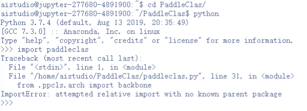

# 项目概述

​		本文重点介绍如何利用飞桨图像分类套件`PaddleClas`在`KTH-TIPS`工业材料表面纹理数据集上，使用当前`PaddleClas`的`HRNet`模型完成视觉领域中的图像分类的任务。图像分类技术通过对纹理数据的分类识别实现材质的自动分类，一定程度上提高材料分类、工业质检等工业自动化方面的效率。

​		**关键词: 工业质检、图像分类、PaddleClas**

## 文档目录结构

- (1) 模型简述
- (2) 环境安装
  - (2.1) `PaddlePaddle`安装
    - (2.1.1) 安装对应版本`PaddlePaddle`
    - (2.1.2) 验证安装是否成功
  - (2.2) `PaddleClas`安装
    - (2.2.1) 下载`PaddleClas`代码
    - (2.2.2) 安装依赖项目
    - (2.2.3) 验证安装是否成功
- (3) 数据准备
  - (3.1) 数据标注
    - (3.1.1) 精灵标注安装
    - (3.1.2) 精灵标注的使用
  - (3.2) 数据格式转化
  - (3.3) 数据划分
- (4) 模型训练
  - (4.1) 训练前数据准备
  - (4.2) 开始训练
  - (4.3) 主要训练参数说明
  - (4.4) 多卡训练
  - (4.5) 恢复训练
  - (4.6) 训练可视化
- (5) 模型验证与预测
  - (5.1) 开始验证
  - (5.2) 主要验证参数说明
  - (5.3) 评估指标说明
  - (5.4) 开始预测
  - (5.5) 输出说明
- (6) 模型部署与转化
- (7) 配置文件的说明
  - (7.1) 整体配置文件格式综述
  - (7.2) 数据路径与数据预处理说明
  - (7.3) 模型说明
  - (7.4) 优化器和损失函数说明
  - (7.5) 其它参数说明
- (8) 部分参数值推荐说明
  - (8.1) 训练批大小
  - (8.2) 训练轮次大小
  - (8.3) 训练学习率大小
  - (8.4) 训练预热迭代轮次

# (1) 模型简述

​		`HRNet`是高分辨率网络，并在整个网络中保持高分辨率表示。该模型有两个关键特征：(1) 有高低分辨率的卷积流；(2) 在不同的块级存在反复跨分辨率的信息交换。因此，`HRNet`所产生的语义表示更富裕，在空间上也更精确。其模型结构如下:


# (2) 环境安装

## (2.1) `PaddlePaddle`安装

### (2.1.1) 安装对应版本`PaddlePaddle`

​		根据系统和设备的`cuda`环境，选择对应的安装包，这里默认使用`pip`在`linux`设备上进行安装。


​		在终端中执行:

```bash
pip install paddlepaddle-gpu==2.3.0.post110 -f https://www.paddlepaddle.org.cn/whl/linux/mkl/avx/stable.html
```

​		安装效果:


### (2.1.2) 验证安装是否成功

```bash
# 安装完成后您可以使用 python进入python解释器，
python
# 继续输入
import paddle 
# 再输入 
paddle.utils.run_check()
```

​		如果出现`PaddlePaddle is installed successfully!`，说明您已成功安装。


## (2.2) `PaddleClas`安装

### (2.2.1) 下载`PaddleClas`代码

​		用户可以通过使用`github`或者`gitee`的方式进行下载，我们当前版本为`PaddleClas`的`release v2.5`版本。后续在使用时，需要对应版本进行下载。


```bash
# github下载
git clone -b release/2.5 https://github.com/PaddlePaddle/PaddleClas.git
# gitee下载
git clone -b release/2.5 https://gitee.com/PaddlePaddle/PaddleClas.git
```

### (2.2.2) 安装依赖项目

* 方式一：
  通过直接`pip install` 安装，可以最高效率的安装依赖

``` bash
pip install paddleclas
```

* 方式二：
  下载`PaddleClas`代码后，进入`PaddleClas`代码文件夹目录下面

``` bash
cd PaddleClas
pip install -r requirements.txt
```

### (2.2.3) 验证安装是否成功

​		如果采用方式一安装依赖项目，则使用以下脚本内容验证是否安装成功，否则无需执行以下验证步骤——无报错即安装成功。

```bash
# 安装完成后您可以使用 python进入python解释器，
python
# 继续输入
import paddleclas
```


**Note**

- 验证安装要在`PaddleClas`目录外，不能在`PaddleClas`目录内执行验证操作——否则会出现以下报错。
- 

# (3) 数据准备

## (3.1) 数据标注

​		无论是图像分类，语义分割，全景分割，还是实例分割，我们都需要充足的训练数据。如果你想使用没有标注的原始数据集做分类任务，你必须先为原始图像作出标注。

### (3.1.1) 精灵标注安装


​		用户在采集完用于训练、评估和预测的图片之后，需使用数据标注工具[精灵标注](http://www.jinglingbiaozhu.com)完成数据标注。

​		精灵标注支持在`Windows/macOS/Linux`三个系统上使用，且三个系统下的标注格式基本一致。具体的安装流程请参见[官方安装指南](http://www.jinglingbiaozhu.com)。

### (3.1.2) 精灵标注的使用

​		安装好精灵标注后，双击打开软件会出现精灵标注的交互界面，选择新建即可选择标注任务，随后展开标注。


​		然后选择图像分类标注。


​		然后在右侧表单中依次选择图片文件夹、该分类任务的所有分类情况，用逗号(英文符号)隔开，配置每一张图像可以分配的种类上限。一般任务只需设置每张图像唯一分类即可。


​		点击创建后进入标注界面，在标注界面左侧可以选择上一张标注图像或下一张标注图像。


​		同时还可以点击设置，修改当前项目的一些基本属性。


​		然后，可以关闭设置界面，回到标注界面，在界面中间偏下有一个白色方框，点击后可选择当前图像的类别。


​		选择好当前图像类别后，点击正下方的蓝色钩按钮进行保存(或`Ctrl+S`保存)，当前图像标注保存成功后会有提示。


​		然后依次点击左侧的后一个(或键盘右方向键)即可往后继续进行图像分类数据的标注。

​		最后，标注完成后，可以点击左侧的导出按钮进行数据标注的导出。选择输出方式为`json`、配置导出路径即可。


​		导出后文件在指定目录下生成`outputs`标注文件目录，并在其中对之前导入的所有图像生成标注文件。(务必对所有导入的图像进行标注后再导出)


## (3.2) 数据格式转化

​		`PaddleX`做为飞桨全流程开发工具，提供了非常多的工具，在这里我们使用`paddlex`进行数据格式转化。
​		首先安装`paddlex`

```bash
pip install paddlex
```

​		目前所有标注工具生成的标注文件，均为与原图同名的`json`格式文件，如`1.jpg`在标注完成后，则会在标注文件保存的目录中生成`1.json`文件。转换时参照以下步骤：

1. 将所有的原图文件放在同一个目录下，如`datasets/helmet`目录  
2. 将所有的标注`json`文件放在同一个目录下，如`datasets/outputs`目录  
3. 使用如下命令进行转换:

```bash
paddlex --data_conversion --source jingling --to ImageNet --pics ./datasets/helmet --annotations ./datasets/outputs --save_dir ./converted_dataset_dir
```

| 参数          | 说明                                                         |
| ------------- | ------------------------------------------------------------ |
| --source      | 表示数据标注来源，支持`labelme`、`jingling`（分别表示数据来源于LabelMe，精灵标注助手） |
| --to          | 表示数据需要转换成为的格式，支持`ImageNet`（图像分类）、`PascalVOC`（目标检测），`MSCOCO`（实例分割，也可用于目标检测）和`SEG`(语义分割) |
| --pics        | 指定原图所在的目录路径                                       |
| --annotations | 指定标注文件所在的目录路径                                   |

​		转换前:


​		转换后:


## (3.3) 数据划分

在这里，我们依旧使用`paddlex`进行数据划分
使用`paddlex`命令即可将数据集随机划分成`70%`训练集，`20%`验证集和`10%`测试集:

```bash
paddlex --split_dataset --format ImageNet --dataset_dir ./converted_dataset_dir --val_value 0.2 --test_value 0.1
```

执行上面命令行，会在`./converted_dataset_dir`下生成 `labels.txt`, `train_list.txt`, `val_list.txt`, `test_list.txt`，分别存储训练样本信息，验证样本信息，测试样本信息。

至此我们的数据就创作完成了，最终我们的产出形态应如下所示

- 文件结构

```bash
|converted_dataset_dir
|--class1
|  |--image1.jpg
|  |--image2.jpg
|  |--...
|--class2
|  |--image1.jpg
|  |--image2.jpg
|  |--...
...
|
|--labels.txt
|
|--train_list.txt
|
|--val_list.txt
|
|--test_list.txt
```

- 文件夹`converted_dataset_dir`为数据目录、`class1`为类别1图像所在目录、`class2`为类别2图像所在目录。其中`converted_dataset_dir`命名不是必须的，用户可以自主进行命名。

- 其中`labels.txt`的内容如下所示(即包含数据集中实际分类名称的文件)

```txt
class1
class2
...
```

- 其中`train.txt`和`val.txt`的内容如下所示：

```txt
class1/image1.jpg 0
...
class2/image1.jpg 1
...
```

​		转换后效果:


**Note**

- 我们一般推荐用户将数据集放置在`PaddleClas`下的`dataset`文件夹下，下文配置文件的修改也是按照该方式。

- 如果按照以上方式制作的数据集要使用`PaddleClas`进行训练，需要在`labels.txt`中进行以下修改——即，对每一个`class`加上一个序号，序号按**升序排列**。

  - ```txt
    0 class1
    1 class2
    ...
    ```

# (4) 模型训练

## (4.1) 训练前准备

​		我们可以通过`PaddleClas`提供的脚本对模型进行训练，在本小节中我们使用`HRNet`模型与`KTH-TIPS`工业材料表面纹理数据集展示训练过程。 在训练之前，最重要的修改自己的数据情况，确保能够正常训练。

​		在本项目中，我们使用`PaddleClas/ppcls/configs/ImageNet/HRNet/HRNet_W18_C.yaml`进行训练。

​		我们需要修改`PaddleClas/ppcls/configs/ImageNet/HRNet/HRNet_W18_C.yaml`中数据集的路径、模型的分类数（`class_num`）、模型类别id与实际类别映射文件以及预测后处理输出类别（设置每张图像只输出1个类别），修改为如下内容。

```yaml
# model architecture
Arch:
  name: HRNet_W18_C
  class_num: 10

# data loader for train and eval
DataLoader:
  Train:
    dataset:
      name: ImageNetDataset
      image_root: ./dataset/KTH_TIPS/
      cls_label_path: ./dataset/KTH_TIPS/train_list.txt
      transform_ops:
        - DecodeImage:
            to_rgb: True
            channel_first: False
        - RandCropImage:
            size: 224
        - RandFlipImage:
            flip_code: 1
        - NormalizeImage:
            scale: 1.0/255.0
            mean: [0.485, 0.456, 0.406]
            std: [0.229, 0.224, 0.225]
            order: ''

    sampler:
      name: DistributedBatchSampler
      batch_size: 128
      drop_last: False
      shuffle: True
    loader:
      num_workers: 4
      use_shared_memory: True

  Eval:
    dataset: 
      name: ImageNetDataset
      image_root: ./dataset/KTH_TIPS/
      cls_label_path: ./dataset/KTH_TIPS/val_list.txt
      transform_ops:
        - DecodeImage:
            to_rgb: True
            channel_first: False
        - ResizeImage:
            resize_short: 256
        - CropImage:
            size: 224
        - NormalizeImage:
            scale: 1.0/255.0
            mean: [0.485, 0.456, 0.406]
            std: [0.229, 0.224, 0.225]
            order: ''
    sampler:
      name: DistributedBatchSampler
      batch_size: 64
      drop_last: False
      shuffle: False
    loader:
      num_workers: 4
      use_shared_memory: True
...
Infer:
  infer_imgs: docs/images/inference_deployment/whl_demo.jpg
  ...
  PostProcess:
    name: Topk
    topk: 1
    class_id_map_file: ./dataset/KTH_TIPS/labels.txt
```

* 关键是改动配置中的路径，这一个涉及相对路径，安照提示一步步来，确保最终能够完成。
* 本次项目中使用到的`KTH-TIPS`工业材料表面纹理数据集包含了810张图片，共10种分类，获取数据集的[链接](https://aistudio.baidu.com/aistudio/datasetdetail/179849) :
  * 下载好数据集后，先进入`PaddleClas`的`dataset`目录下，然后创建`KTH_TIPS`文件夹，接着再把下载好的数据集放在该文件夹内，在该文夹内进行解压提取文件。
  * 解压好数据集后，执行以下脚本将数据按照`70%`用于训练、`20%`用于验证、`10%`用于测试进行划分。

```bash
paddlex --split_dataset --format ImageNet --dataset_dir ./dataset/KTH_TIPS --val_value 0.2 --test_value 0.1
```

- 以上脚本要保证工作目录已进入到`PaddleClas`目录

- 数据集解压并划分好后的效果:

  - 

  - 另外还需修改`labels.txt`内容如下:

  - ```txt
    0 aluminium_foil
    1 brown_bread
    2 corduroy
    3 cotton
    4 cracker
    5 linen
    6 orange_peel
    7 sandpaper
    8 sponge
    9 styrofoam
    ```

## (4.2) 开始训练

​		请确保已经完成了`PaddleClas`的安装工作，并且当前位于`PaddleClas`目录下，执行以下脚本：

```bash
export CUDA_VISIBLE_DEVICES=0 # 设置1张可用的卡
# windows下请执行以下命令
# set CUDA_VISIBLE_DEVICES=0

python tools/train.py \
       -c ./ppcls/configs/ImageNet/HRNet/HRNet_W18_C.yaml \
       -o Arch.pretrained=True \
       -o Global.epochs=40 \
       -o Global.eval_interval=2 \
       -o Global.save_interval=2 \
       -o Global.print_batch_step=10 \
	   -o Global.use_visualdl=True \
	   -o Global.output_dir=./outputs \
	   -o Global.eval_during_train=True
```

​		执行效果:


## (4.3) 主要训练参数说明

| 参数名                      | 用途                                            | 是否必选项 | 默认值 |
| :-------------------------- | :---------------------------------------------- | :--------- | :----- |
| -c                          | 指定模型的yaml-config文件                       | 是         | -      |
| -o                          | 覆盖配置文件中的指定参数值                      | 否         | -      |
| -o Arch.pretrained=True     | 覆盖配置文件中的模型加载预训练权重状态值        | 否         | -      |
| -o Global.epochs            | 覆盖配置文件中的训练迭代轮次值                  | 否         | -      |
| -o Global.eval_interval     | 覆盖配置文件中的评估间隔轮次值                  | 否         | -      |
| -o Global.save_interval     | 覆盖配置文件中的模型保存间隔轮次值              | 否         | -      |
| -o Global.print_batch_step  | 覆盖配置文件中的每个batch训练日志输出迭代间隔值 | 否         | -      |
| -o Global.use_visualdl      | 覆盖配置文件中的visualdl日志器的状态值          | 否         | -      |
| -o Global.output_dir        | 覆盖配置文件中的模型保存/输出路径               | 否         | -      |
| -o Global.eval_during_train | 覆盖配置文件中的训练时评估模式的状态值          | 否         | -      |

## (4.4) 多卡训练

​		如果想要使用多卡训练的话，需要将环境变量`CUDA_VISIBLE_DEVICES`指定为多卡（不指定时默认使用所有的`gpu`)，并使用`paddle.distributed.launch`启动训练脚本（`windows`下由于不支持`nccl`，无法使用多卡训练）:

```bash
export CUDA_VISIBLE_DEVICES=0,1,2,3 # 设置4张可用的卡
python -m paddle.distributed.launch tools/train.py \
       -c ./ppcls/configs/ImageNet/HRNet/HRNet_W18_C.yaml \
       -o Arch.pretrained=True \
       -o Global.epochs=40 \
       -o Global.eval_interval=2 \
       -o Global.save_interval=2 \
       -o Global.print_batch_step=10 \
	   -o Global.use_visualdl=True \
	   -o Global.output_dir=./outputs \
	   -o Global.eval_during_train=True
```

​		执行效果:


## (4.5) 恢复训练

```bash
python tools/train.py \
       -c ./ppcls/configs/ImageNet/HRNet/HRNet_W18_C.yaml \
       -o Global.checkpoints=./outputs/HRNet_W18_C/epoch_14 \
       -o Global.epochs=40 \
       -o Global.eval_interval=2 \
       -o Global.save_interval=2 \
       -o Global.print_batch_step=10 \
	   -o Global.use_visualdl=True \
	   -o Global.output_dir=./outputs \
	   -o Global.eval_during_train=True
```

​		执行效果:


## (4.6) 训练可视化

​		`PaddleClas`会将训练过程中的数据写入`VisualDL`文件，并实时的查看训练过程中的日志，记录的数据包括：（当`-o Global.use_visualdl=True`开启后生效）

1. `loss`变化趋势

2. 学习率变化趋势

3. 日志记录时间

4. `top1`变化趋势

5. `top5`变化趋势

6. 评估精度(`acc`)变化趋势（当`-o Global.eval_during_train=True`开启后生效）

   ​	使用如下命令启动`VisualDL`查看日志

```bash
# 下述命令会在127.0.0.1上启动一个服务，支持通过前端web页面查看，可以通过--host这个参数指定实际ip地址
visualdl --logdir outputs/vdl
```

​		在浏览器输入提示的网址，效果如下：


# (5) 模型验证与预测

## (5.1) 开始验证

​		训练完成后，用户可以使用评估脚本tools/eval.py来评估模型效果。假设训练过程中迭代轮次（epochs）为40，保存模型的间隔为2，即每迭代2个轮次的数据集就会保存1次训练的模型。因此一共会产生20个定期保存的模型，加上保存的最佳模型`best_model`以及最近保存的模型`latest`，一共有22个模型，可以通过`-o Global.pretrained_model`指定期望评估的模型文件。

```bash
python tools/eval.py \
    -c ./ppcls/configs/ImageNet/HRNet/HRNet_W18_C.yaml \
    -o Global.pretrained_model=./outputs/HRNet_W18_C/best_model
```

​		执行效果:


## (5.2) 主要验证参数说明

| 参数名                     | 用途                       | 是否必选项 | 默认值 |
| :------------------------- | :------------------------- | :--------- | :----- |
| -c                         | 指定模型的yaml-config文件  | 是         | -      |
| -o Global.pretrained_model | 指定模型加载特定的权重文件 | 否         | -      |

**注意** 如果你想提升显存利用率，可以适当的提高 `num_workers` 的设置，以防GPU工作期间空等。设置评估时的 `num_workers` 指令如下:

```bash
python tools/eval.py \
    -c ./ppcls/configs/ImageNet/HRNet/HRNet_W18_C.yaml \
    -o Global.pretrained_model=./outputs/HRNet_W18_C/best_model \
    -o DataLoader.Eval.loader.num_workers=6
```

## (5.3) 评估指标说明

​		在图像分类领域中，评估模型质量主要是准确率（`acc`）来评估的。

- 准确率（`Acc`）：表示预测正确的样本数占总数据的比例，准确率越高越好

  - `Top1 Acc`：预测结果中概率最大的所在分类正确，则判定为正确；

  - `Top5 Acc`：预测结果中概率排名前 5 中有分类正确，则判定为正确；

    随着评估脚本的运行，最终打印的评估日志如下：

```bash
W1127 17:38:02.389449  3553 gpu_resources.cc:61] Please NOTE: device: 0, GPU Compute Capability: 7.0, Driver API Version: 11.2, Runtime API Version: 11.2
W1127 17:38:02.397325  3553 gpu_resources.cc:91] device: 0, cuDNN Version: 8.2.
[2022/11/27 17:38:08] ppcls INFO: [Eval][Epoch 0][Iter: 0/3]CELoss: 0.18585, loss: 0.18585, top1: 0.95312, top5: 1.00000, batch_cost: 3.28456s, reader_cost: 1.00044, ips: 19.48510 images/sec
[2022/11/27 17:38:08] ppcls INFO: [Eval][Epoch 0][Avg]CELoss: 0.16140, loss: 0.16140, top1: 0.94375, top5: 1.00000
```

## (5.4) 开始预测

​		除了可以分析模型的准确率指标之外，我们还可以对一些具体样本的预测效果，从`Bad Case`启发进一步优化的思路。

​		`tools/infer.py`脚本是专门用来可视化预测案例的，命令格式如下所示：

```bash
python tools/infer.py \
    -c ./ppcls/configs/ImageNet/HRNet/HRNet_W18_C.yaml \
    -o Global.pretrained_model=./outputs/HRNet_W18_C/best_model \
    -o Infer.infer_imgs=dataset/KTH_TIPS/orange_peel/55-scale_8_im_3_col.png
```

​		预测图片:


​		执行效果:


​		其中`-o Infer.infer_imgs`可以指定一张图片的路径。

**Note**

* 批量预测一个图像目录下的所有图像，使用以下指令:

```bash
python tools/infer.py \
    -c ./ppcls/configs/ImageNet/HRNet/HRNet_W18_C.yaml \
    -o Global.pretrained_model=./outputs/HRNet_W18_C/best_model \
    -o Infer.infer_imgs=dataset/KTH_TIPS/orange_peel/ \
    -o Infer.batch_size=16
```

- 其中，batch_size表示每一次预测批量处理16张图像，并且输出结果中，会将每16个结果放在一个列表中输出：


## (5.5) 输出说明

- 在执行预测时，仅需要原始图像。无论是单张图片预测还是目录预测，都会输出每个样本的预测结果如下：

```bash
[{'class_ids': [6], 'scores': [1.0], 'file_name': 'dataset/KTH_TIPS/orange_peel/55-scale_8_im_3_col.png', 'label_names': ['orange_peel']}]
```

其中:

- class_ids: 表示预测类别的id号
- scores: 预测为该类别的得分
- file_name: 当前预测的文件名称
- label_names: 预测类别id所属的实际类别

# (6) 模型部署与转化

- 待补充

# (7) 配置文件说明

​		正是因为有配置文件的存在，我们才可以使用更便捷的进行消融实验。在本章节中我们选择
```PaddleClas/ppcls/configs/ImageNet/HRNet/HRNet_W18_C.yaml```文件来进行配置文件的详细解读

## (7.1) 整体配置文件格式综述

我们将```HRNet_W18_C.yaml```进行拆分解释

  * **HRNet**表示模型的名称
  * **W18**表示模型的最小分支通道数(基础通道数)——W18对应模型的高分辨率多分支结构中的最小通道数为18
  * **C**表示模型输出为分类的聚合模式——将输出的多分支特征进行聚合得到最终的分类特征

**引入配置文件的说明**

​		当前`PaddleClas`为了降低配置网络的难度，利用配置文件进行训练、评估等模型的加载工作。要实现一个模型的训练，往往就需要至少1个配置文件才可运行，如，我们现在选择的```HRNet_W18_C.yaml```。

## (7.2) 数据路径与数据预处理说明

​		这一小节主要是说明数据部分，当准备好数据，如何进行配置文件修改，以及该部分的配置文件有什么内容。
​		如下是截取的是```HRNet_W18_C.yaml```配置。

```yaml
DataLoader: # 数据加载器配置部分
  Train: # 训练数据加载部分
    dataset: # 训练数据集配置
      name: ImageNetDataset # 数据集类型 —— 统一使用ImageNetDataset格式
      image_root: ./dataset/KTH_TIPS/ #数据集路径
      cls_label_path: ./dataset/KTH_TIPS/train_list.txt #根据该txt寻找验证的数据路径
      transform_ops: #数据预处理/增强的方式
        - DecodeImage: # 读取图像
            to_rgb: True # 图像读取后转为RGB图像格式
            channel_first: False # 转换图像数据为通道在前
        - RandCropImage: #从原始图像中随机裁剪224x224大小
            size: 224
        - RandFlipImage: #将原始图像随机左右翻转
            flip_code: 1
        - NormalizeImage: #将图像归一化
            scale: 1.0/255.0 # 归一化缩放因子
            mean: [0.485, 0.456, 0.406] # 归一化均值
            std: [0.229, 0.224, 0.225] # 归一化方差
            order: '' # 归一化前数据格式，不配置默认为HWC
    sampler: # 数据采样器配置部分
      name: DistributedBatchSampler # 采样器类型——分布式批量数据采样器
      batch_size: 256 # 每次采样的batch size
      drop_last: False # 不丢弃数据集末尾采样不足batch_size大的训练数据
      shuffle: True # 随机打乱训练数据顺序
    loader: # 数据加载其它参数配置
      num_workers: 8 # 每张GPU reader进程个数
      use_shared_memory: True # 加载使用共享内存

  Eval: # 验证数据加载部分
    dataset: # 验证数据集配置
      name: ImageNetDataset # 数据集类型 —— 统一使用ImageNetDataset格式
      image_root: ./dataset/KTH_TIPS/ #数据集路径
      cls_label_path: ./dataset/KTH_TIPS/val_list.txt #根据该txt寻找验证的数据路径
      transform_ops: #数据预处理/增强的方式
        - DecodeImage: # 读取图像
            to_rgb: True # 图像读取后转为RGB图像格式
            channel_first: False # 转换图像数据为通道在前
        - ResizeImage: # 缩放图像大小为256*256
            resize_short: 256 
        - CropImage: # 裁剪原始图像224*224的中心区域
            size: 224
        - NormalizeImage: #将图像归一化
            scale: 1.0/255.0 # 归一化缩放因子
            mean: [0.485, 0.456, 0.406] # 归一化均值
            std: [0.229, 0.224, 0.225] # 归一化方差
            order: '' # 归一化前数据格式，不配置默认为HWC
    sampler: # 数据采样器配置部分
      name: DistributedBatchSampler # 采样器类型——分布式批量数据采样器
      batch_size: 64 # 每次采样的batch size
      drop_last: False # 不丢弃数据集末尾采样不足batch_size大的训练数据
      shuffle: False # 不随机打乱训练数据顺序
    loader: # 数据加载其它参数配置
      num_workers: 4 # 每张GPU reader进程个数
      use_shared_memory: True # 加载使用共享内存
```

**Note**

* 关于如何正确来写`image_root`以及`cls_label_path`是非常关键的，可以根据上一章节训练的过程以及数据标注章节进行相对文件夹路径的推演。
* `class_num`配置需要在`HRNet_W18_C.yaml`中的以下位置配置:

```yaml
# model architecture
Arch:
  name: HRNet_W18_C
  class_num: 10
```

- 预测时对应的id与实际类别映射的文件需要配置好才能保证预测结果中的类别名称正确，其改动需要在`HRNet_W18_C.yaml`中的以下位置配置:

```yaml
Infer:
  infer_imgs: docs/images/inference_deployment/whl_demo.jpg
  batch_size: 10
  ...
  PostProcess:
    name: Topk
    topk: 1 # 预测每张图像最可能的类别数，一般设置为1，即表示预测输出当前图像的实际类别
    class_id_map_file: dataset/KTH_TIPS/labels.txt # 修改为当前数据集的类别映射文件即可，该文件格式即第二章中数据划分所示的labels.txt
```

## (7.3) 模型说明

当我们配置好数据后，下面在看关于模型的选择说明

``` yaml
Arch:
  name: HRNet_W18_C
  class_num: 10
  pretrained: True # yaml可能不包含，但是可以自行添加
```

  **Note**

* 我们模型的`name`是`HRNet_W18_C`，即表示选用`HRNet_W18_C`这个模型
  * 类似的，`PaddleClas`还包含: `HRNet_W32_C`、`HRNet_W48_C`、`HRNet_W64_C`等同类不同配置的模型网络，详细可查看[官网模型](https://github.com/PaddlePaddle/PaddleClas/tree/release/2.5/ppcls/configs/ImageNet/HRNet)
* `class_num` 配置该模型总的预测类别数
* `pretrained` 配置是否加载预训练模型辅助训练
* `PaddleClas`对于不同的模型有不同的`yaml`配置文件，可以在`ppcls/configs/ImageNet`或`ppcls/configs`下查询相应模型

## (7.4) 优化器和损失函数说明

当我们配置好数据以及选定模型后，可以再进行优化器以及损失函数的选择(在`HRNet_W18_C.yaml`)

``` yaml
Optimizer: # 优化器配置部分
  name: Momentum # 优化器类型 —— 动量优化器
  momentum: 0.9 # 动量大小
  lr: # 学习率配置
    name: Piecewise # 学习率策略类型 —— 分段衰减策略
    learning_rate: 0.1 # 基础学习率大小
    decay_epochs: [30, 60, 90] # 分段轮次: 第30轮、第60轮、第90轮发生学习率变化
    values: [0.1, 0.01, 0.001, 0.0001] # 分段学习率变化值: 第30轮前为0.1，第30轮及其后为0.01，第60轮及其后为0.001，第90轮及其后为0.0001
  regularizer: # 正则化配置
    name: 'L2' # 正则化类型 —— L2正则，另外还有L1正则
    coeff: 0.0001 # 正则因子

Loss: # 损失函数配置部分
  Train: # 训练损失函数部分
    - CELoss: # 交叉熵损失
        weight: 1.0 # 权重大小为1.0
  Eval: # 验证损失函数部分
    - CELoss: # 交叉熵损失
        weight: 1.0 # 权重大小为1.0
```

**Note**

*  学习率策略类型支持有`Piecewise`, `MultiStepDecay`, `Step`等6种
*  优化器类型支持有`AdamWDL`, `AdamW`,` RMSProp`, `SGD`等6种

## (7.5) 其它参数说明

``` yaml
Global: # 公共配置
  checkpoints: null # 检查点 —— 即断训的路径描述(不包括.pdparams后缀)
  pretrained_model: null # 训练好的模型路径描述(不包括.pdparams后缀)
  output_dir: ./output/ # 模型保存路径
  device: gpu # 模型运行/执行设备为GPU
  save_interval: 1 # 保存轮次间隔
  eval_during_train: True # 边训练边评估 —— 按照验证轮次间隔进行评估
  eval_interval: 1 # 验证轮次间隔
  epochs: 360 # 训练总轮次
  print_batch_step: 10 # 日志输出间隔
  use_visualdl: False # 不适用visualdl进行日志记录
  # used for static mode and model export
  image_shape: [3, 224, 224] # 处理的图像大小 —— 导出部署模型时的图像大小
  save_inference_dir: ./inference # 部署模型导出路径
```

``` yaml
Metric: # 评估标准配置
  Train: # 训练评估标准部分
    - TopkAcc: # Topk精确度评估标准
        topk: [1, 5] # Top5精确度的评估标准
  Eval: # 验证评估标准部分
    - TopkAcc: # Topk精确度评估标准
        topk: [1, 5] # Top5精确度的评估标准
```

# (8) 部分参数值推荐说明

## (8.1) 训练批大小

```yaml
batch_size: 256
```

​		批大小(batch_size)通常取值: **32, 64, 128, 256, 512**。

​		一般可以按照数据集中训练的样本(图像)数量大小以及期望一轮训练迭代次数来大致取值。

- 如果数据集训练样本数量为: `N`
- 期望一轮训练迭代次数为: `I`
- 得到大致`batch_size`大小: `B = N/I`

如果B大于32小于64，则可以选32；以此类推。

**Note**

- `batch_size`会受显存大小影响，因此过大的批大小可能大致运行训练失败——因为GPU显存不够。
- `batch_size` 是训练神经网络中的一个重要的超参数，该值决定了一次将多少数据送入神经网络参与训练。论文 [Accurate, Large Minibatch SGD: Training ImageNet in 1 Hour](https://arxiv.org/abs/1706.02677)，当 `batch size` 的值与学习率的值呈线性关系时，收敛精度几乎不受影响。在训练 ImageNet 数据时，大部分的神经网络选择的初始学习率为 0.1，`batch size` 是 256，所以根据实际的模型大小和显存情况，可以将学习率设置为 0.1*k, batch_size 设置为 256*k。在实际任务中，也可以将该设置作为初始参数，进一步调节学习率参数并获得更优的性能。
- 拟合效果不好时，可以适当增大`batch_size`的大小以改善短期的训练效果；若存在过拟合，则可以尝试采用小一些的`batch_size`——注意，此时训练轮次一般可以不改变，但是可能存在训练最优轮次提前出现或者延后出现。

## (8.2) 训练轮次大小

```bash
-o Global.epochs=40 
```

​		轮次(`epochs`)通常取值: **50, 100, 150, 200。**

​		如果取50轮效果不理想，可以用100轮尝试，如果效果有提升则可以用大的训练轮次进行训练。

## (8.3) 训练学习率大小

```yaml
learning_rate: 0.1
```

​		学习率(`learning_rate`)通常取配置文件的默认值，如果性能不好，可以尝试调小或调大，公式: $new\_lr=lr * ratio$。其中调小时: `ratio`可以取`0.5`或者`0.1`；而调大时:  `ratio`可以取或`1.0`者`2.0`。但学习率一般不超过1.0，否则容易训练不稳定。

​		如果配置文件所对应的模型默认为N卡训练的模型，则需要对学习率除以卡数N: $new\_lr=lr / N$。

​		由于本模型默认为4卡训练的，因此如果是在单卡上训练该模型需要修改学习率为`0.025`。(由于此时学习率变化相对较小，因此也可以保持不变进行训练)

## (8.4) 训练预热迭代轮次

```yaml
warmup_epoch: 5
```

​		预热迭代轮次(`warmup_epoch`)一般取总迭代轮次的`1/20`或`1/15`。