# 项目概述

​		本文重点介绍如何利用飞桨目标检测套件`PaddleDetection`在路标检测数据集上，使用当前`PaddleDetection`的`PP-YOLOE`模型完成视觉领域中的目标检测的任务。目标检测技术通过对路标的定位识别实现前方路标的自动检测，从而辅助智能驾驶等应用领域。

​		**关键词: 智慧交通、目标检测、PaddleDetection**

## 文档目录结构

- (1) 模型简述
- (2) 环境安装
  - (2.1) `PaddlePaddle`安装
    - (2.1.1) 安装对应版本`PaddlePaddle`
    - (2.1.2) 验证安装是否成功
  - (2.2) `PaddleDetection`安装
    - (2.2.1) 下载`PaddleDetection`代码
    - (2.2.2) 安装依赖项目
    - (2.2.3) 验证安装是否成功
- (3) 数据准备
  - (3.1) 数据标注
    - (3.1.1) LabelMe安装
    - (3.1.2) LabelMe的使用
  - (3.2) 数据格式转化
  - (3.3) 数据划分
- (4) 模型训练
  - (4.1) 训练前数据准备
  - (4.2) 开始训练
  - (4.3) 主要训练参数说明
  - (4.4) 多卡训练
  - (4.5) 恢复训练
  - (4.6) 训练可视化
- (5) 模型验证与预测
  - (5.1) 开始验证
  - (5.2) 主要验证参数说明
  - (5.3) 评估指标说明
  - (5.4) 开始预测
  - (5.5) 主要预测参数说明
  - (5.6) 输出说明
- (6) 模型部署与转化
- (7) 配置文件的说明
  - (7.1) 整体配置文件格式综述
  - (7.2) 数据路径与数据预处理说明
  - (7.3) 模型与损失函数说明
  - (7.4) 优化器说明
  - (7.5) 其它参数说明
- (8) 部分参数值推荐说明
  - (8.1) 训练批大小
  - (8.2) 训练轮次大小
  - (8.3) 训练学习率大小
  - (8.4) 训练预热迭代轮次
  - (8.5) 评估时的NMS参数设置

# (1) 模型简述

​		`PP-YOLOE`是基于无锚策略的高性能和部署友好的目标检测模型。该模型继`PP-Yolov2`进一步优化，使用更强大的骨干网络以及颈部(`Head`)网络，结合动态标签分配算法`TAL`，从而提高了网络的性能。`PP-YOLOE`推理速度以张力和`FP16`精确率达到`149.2 fps`。其模型结构如下:

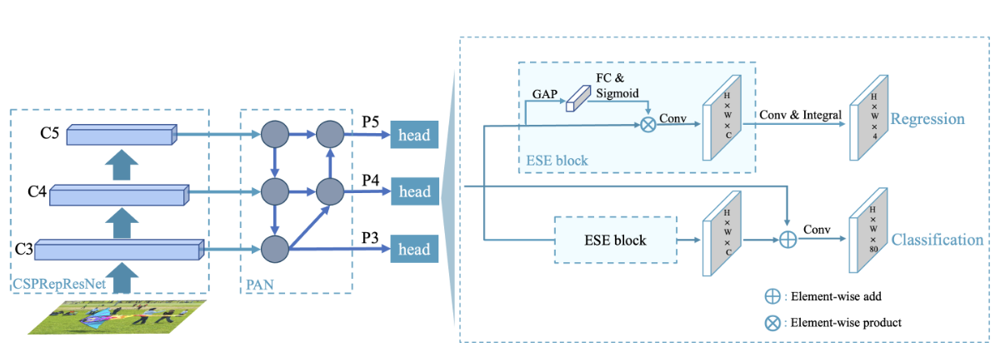

# (2) 环境安装

## (2.1) `PaddlePaddle`安装

### (2.1.1) 安装对应版本`PaddlePaddle`

​		根据系统和设备的`cuda`环境，选择对应的安装包，这里默认使用`pip`在`linux`设备上进行安装。


​		在终端中执行:

```bash
pip install paddlepaddle-gpu==2.3.0.post110 -f https://www.paddlepaddle.org.cn/whl/linux/mkl/avx/stable.html
```

​		安装效果:


### (2.1.2) 验证安装是否成功

```bash
# 安装完成后您可以使用 python进入python解释器，
python
# 继续输入
import paddle 
# 再输入 
paddle.utils.run_check()
```

​		如果出现`PaddlePaddle is installed successfully!`，说明您已成功安装。

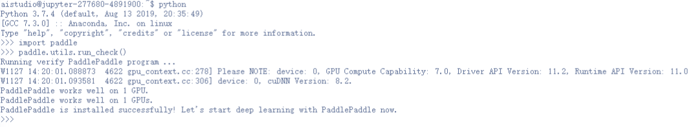

## (2.2) `PaddleDetection`安装

### (2.2.1) 下载`PaddleDetection`代码

​		用户可以通过使用`github`或者`gitee`的方式进行下载，我们当前版本为`PaddleDetection`的release v2.5版本。后续在使用时，需要对应版本进行下载。


```bash
# github下载
git clone -b release/2.5 https://github.com/PaddlePaddle/PaddleDetection.git
# gitee下载
git clone -b release/2.5 https://gitee.com/PaddlePaddle/PaddleDetection.git
```

### (2.2.2) 安装依赖项目

* 方式一：
  通过直接`pip install` 安装，可以最高效率的安装依赖

``` bash
pip install paddledet
```

* 方式二：
  下载`PaddleDetection`代码后，进入`PaddleDetection`代码文件夹目录下面

``` bash
cd PaddleDetection
pip install -r requirements.txt
```

### (2.2.3) 验证安装是否成功

​		在`PaddleDetection`目录下执行如下命令，会进行简单的单卡训练和单卡预测。等待模型下载以及查看执行日志，若没有报错，则验证安装成功。

```bash
python tools/infer.py -c configs/ppyolo/ppyolo_r50vd_dcn_1x_coco.yml -o use_gpu=true weights=https://paddledet.bj.bcebos.com/models/ppyolo_r50vd_dcn_1x_coco.pdparams --infer_img=demo/000000014439.jpg
```

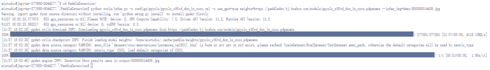

# (3) 数据准备

## (3.1) 数据标注

​		无论是语义分割，实例分割，还是目标检测，我们都需要充足的训练数据。如果你想使用没有标注的原始数据集做目标检测任务，你必须先为原始图像作出标注。

### (3.1.1) LabelMe安装


​		用户在采集完用于训练、评估和预测的图片之后，需使用数据标注工具[LabelMe](https://github.com/wkentaro/labelme)完成数据标注。

​		`LabelMe`支持在`Windows/macOS/Linux`三个系统上使用，且三个系统下的标注格式是一样。具体的安装流程请参见[官方安装指南](https://github.com/wkentaro/labelme)。

### (3.1.2) LabelMe的使用

​		打开终端输入`labelme`会出现`LableMe`的交互界面，可以先预览`LabelMe`给出的已标注好的图片，再开始标注自定义数据集。


- 开始标注

请按照下述步骤标注数据集：

​        (1)   点击`OpenDir`打开待标注图片所在目录，点击`Create Polygons`，然后鼠标右键选择 `create Retangle` 沿着目标构建矩形框，绘制好区域后按下回车，然后输入目标的类别。在标注过程中，如果某一个矩形框画错了，可以按撤销快捷键可撤销该矩形框。`Windows/Mac`下的撤销快捷键为`command+Z`。(在选定矩形框后，后续只要不重新点击`Create Polygons`均保持为矩形框绘制)


​		(2)   右击选择`Edit Polygons`可以整体移动矩形的位置，可以调整矩形大小，也可以选中后右键点击删除该的位置；右击选择`Edit Label`还可以修改每个目标的类别。请根据自己的需要执行这一步骤，若不需要修改，可跳过。


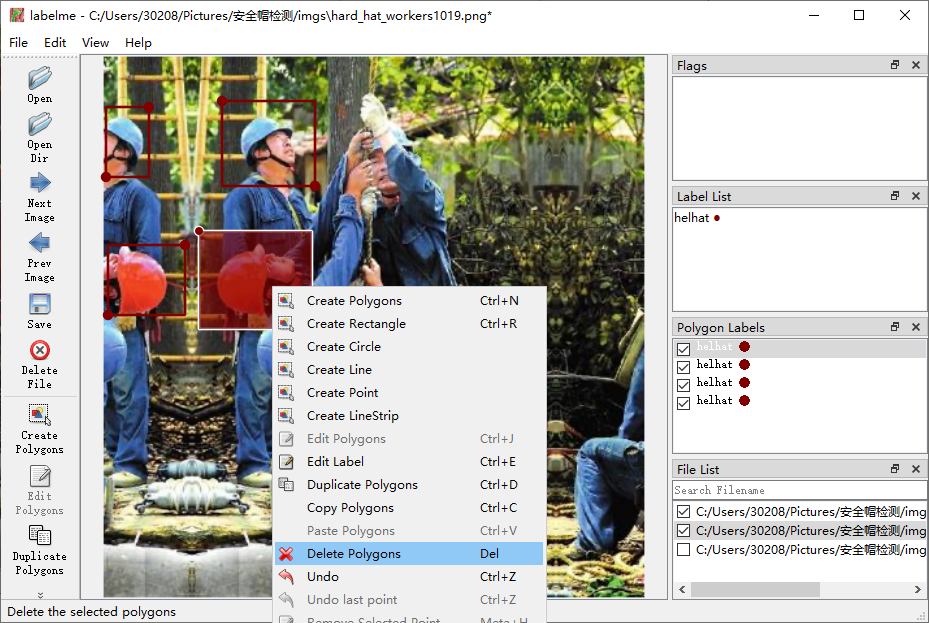

​		(3)   图片中所有目标的标注都完成后，点击`Save`保存`json`文件，**请将json文件和图片放在同一个文件夹里**，点击`Next Image`标注下一张图片(标注`save`完成后右侧图像原始路径旁会打勾)。


## (3.2) 数据格式转化

​		`PaddleX`做为飞桨全流程开发工具，提供了非常多的工具，在这里我们使用`paddlex`进行数据格式转化。
​		首先安装`paddlex`

```bash
pip install paddlex
```

​		目前所有标注工具生成的标注文件，均为与原图同名的`json`格式文件，如`1.jpg`在标注完成后，则会在标注文件保存的目录中生成`1.json`文件。转换时参照以下步骤：

1. 将所有的原图文件放在同一个目录下，如`datasets`目录  
2. 将所有的标注`json`文件放在同一个目录下，如`datasets`目录  
3. 使用如下命令进行转换:

```bash
paddlex --data_conversion --source labelme --to MSCOCO --pics ./datasets --annotations ./datasets --save_dir ./converted_dataset_dir
```

| 参数          | 说明                                                         |
| ------------- | ------------------------------------------------------------ |
| --source      | 表示数据标注来源，支持`labelme`、`jingling`（分别表示数据来源于LabelMe，精灵标注助手） |
| --to          | 表示数据需要转换成为的格式，支持`ImageNet`（图像分类）、`PascalVOC`（目标检测），`MSCOCO`（实例分割，也可用于目标检测）和`SEG`(语义分割) |
| --pics        | 指定原图所在的目录路径                                       |
| --annotations | 指定标注文件所在的目录路径                                   |

​		转换前:

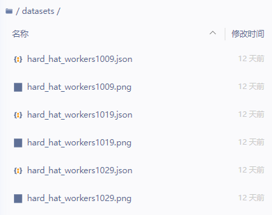

​		转换后:

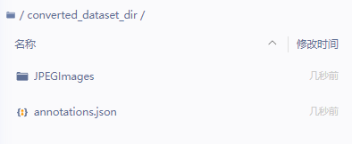

**Note**

- 对于目标检测主要有两种数据集格式: COCO与VOC，上述转换为COCO转换。因此，如果需要转换为VOC，可采用以下指令:

  ```bash
  paddlex --data_conversion --source labelme --to PascalVOC --pics ./datasets --annotations ./datasets --save_dir ./converted_dataset_dir
  ```


- VOC转换后的效果:
- 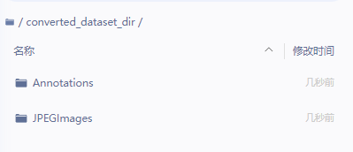

## (3.3) 数据划分

在这里，我们依旧使用`paddlex`进行数据划分
使用`paddlex`命令即可将数据集随机划分成`70%`训练集，`20%`验证集和`10%`测试集。

(1.`COCO`格式数据的划分: 保证数据集已经由2.2中所述转为`MSCOCO`格式数据集)

```bash
paddlex --split_dataset --format COCO --dataset_dir ./converted_dataset_dir --val_value 0.2 --test_value 0.1
```

执行上面命令行，会在`./converted_dataset_dir`下生成`train.json`, `val.json`, `test.json`，分别存储训练样本信息，验证样本信息，测试样本信息。

至此我们的数据就创作完成了，最终我们的产出形态应如下所示

- 文件结构

```bash
custom_dataset
|
|--JPEGImages
|  |--image1.jpg
|  |--image2.jpg
|  |--...
|
|--...
|
|--train.json
|
|--val.json
|
|--test.json
```

- 文件夹命名为`custom_dataset`不是必须，用户可以自主进行命名。

- 其中`train.json`的内容如下所示：

  ```txt
  root:
  	annotations:
  		0:
  			...
  			bbox:
  				0:62.19847328244276
                   1:163.22519083969465
                   2:125.95419847328242
                   3:123.66412213740458
               area:15576.015383718894
               category_id:1
               id:8
          1:
           	...
          ...
      images:
      	...
      categories:
      	...
  ```

  ​	转换后效果:

  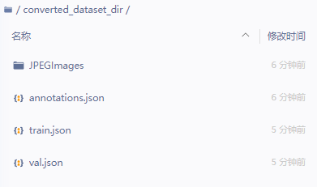

(2.`VOC`格式数据的划分: 保证数据集已经由2.2中所述转为`PascalVOC`格式数据集)

```bash
paddlex --split_dataset --format VOC --dataset_dir ./converted_dataset_dir --val_value 0.2 --test_value 0.1
```

执行上面命令行，会在`./converted_dataset_dir`下生成`labels.txt`, `train_list.txt`, `val_list.txt`, `test_list.txt`，分别存储类别信息，训练样本信息，验证样本信息，测试样本信息。

至此我们的数据就创作完成了，最终我们的产出形态应如下所示

- 文件结构

```bash
custom_dataset
|
|--Annotations
|  |--image1.xml
|  |--image2.xml
|  |--...
|
|--JPEGImages
|  |--image1.jpg
|  |--image2.jpg
|  |--...
|
|--...
|
|--labels.txt
|
|--train_list.txt
|
|--val_list.txt
|
|--test_list.txt
```

- 文件夹命名为`custom_dataset`不是必须，用户可以自主进行命名。
- 其中`labels.txt`的内容如下:

```txt
class1
class2
...
```

- 其中`train.txt`的内容如下所示：

```bash
JPEGImages/image1.png Annotations/image1.xml
JPEGImages/image2.png Annotations/image2.xml
...
```

​		转换后效果:

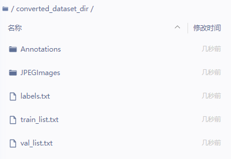

**Note**

- 我们一般推荐用户将数据集放置在`PaddleDetection`下的`dataset`文件夹下，下文配置文件的修改也是按照该方式。

- 在本文中，后续配置将使用`VOC`数据集进行训练等步骤的展示。


# (4) 模型训练

## (4.1) 训练前准备

​		我们可以通过`PaddleDetection`提供的脚本对模型进行训练，在本小节中我们使用`PP-YOLOE`模型与`Road Sign Detection`数据集展示训练过程。 在训练之前，最重要的修改自己的数据情况，确保能够正常训练。

​		在本项目中，我们使用```configs/ppyoloe/ppyoloe_crn_s_300e_coco.yml```进行训练。

​		我们发现`ppyoloe_crn_s_300e_coco.yml`，需要逐层依赖`../datasets/coco_detection.yml`、`_base_/ppyoloe_crn.yml`、`_base_/optimizer_300e.yml` 、`_base_/ppyoloe_reader.yml`、`../runtime.yml`。

​		由于后续使用数据为`VOC`格式数据，因此需要替换`ppyoloe_crn_s_300e_coco.yml`的依赖`../datasets/coco_detection.yml`为`../datasets/voc.yml`，然后再进行相应的数据配置修改，依赖修改如下:

```yaml
_BASE_: [
  '../datasets/voc.yml',
  '../runtime.yml',
  './_base_/optimizer_300e.yml',
  './_base_/ppyoloe_crn.yml',
  './_base_/ppyoloe_reader.yml',
]
...
```

​		在这里改动`../datasets/voc.yml`中文件的路径，修改为如下内容。

```yaml
metric: VOC # VOC数据集评价指标: 支持VOC与COCO两种
map_type: 11point # VOC评价指标的类型: 支持11point(插值)与integral(积分)两种
num_classes: 4 # 数据的分类数(不包含类别背景)

TrainDataset: # 训练数据集配置
  !VOCDataSet
    dataset_dir: dataset/roadsign_voc # 1.数据集所在根目录
    anno_path: train.txt # 2.标注记录的txt: 即dataset/roadsign_voc/train.txt
    label_list: label_list.txt # 3.类别记录的txt: 即dataset/roadsign_voc/label_list.txt
    data_fields: ['image', 'gt_bbox', 'gt_class', 'difficult']

EvalDataset: # 验证数据集配置
  !VOCDataSet
    dataset_dir: dataset/roadsign_voc # 1.数据集所在根目录
    anno_path: valid.txt # 2.标注记录的txt: 即dataset/roadsign_voc/valid.txt
    label_list: label_list.txt # 3.类别记录的txt: 即dataset/roadsign_voc/label_list.txt
    data_fields: ['image', 'gt_bbox', 'gt_class', 'difficult']

TestDataset: # 预测数据集配置
  !ImageFolder
    anno_path: dataset/roadsign_voc/label_list.txt # 预测支持的类别记录的txt: 即dataset/roadsign_voc/label_list.txt
```

**Note**

* 关键改动的配置中的路径，这一个涉及相对路径，安照提示一步步来，确保最终能够完成。
* 本次项目中使用到的数据[下载链接](https://paddlemodels.bj.bcebos.com/object_detection/roadsign_voc.tar)，本章节将使用路标检测（`Road Sign Detection`）数据集进行训练，路标检测是一组不同路标组成的`VOC`格式数据集，包含了701张训练图片、176张验证图片、0张测试图片，包含4个类别: `crosswalk`，`speedlimit`，`stop`，`trafficlight`.(以下是目录结构)

```bash
|--roadsign_voc
|	|--annotations
|		|--image1.xml
|		|--...
|	|--images
|		|--image1.png
|		|--...
|	|--label_list.txt
|	|--train.txt
|	|--valid.txt
```

## (4.2) 开始训练

​		请确保已经完成了`PaddleDetection`的安装工作，并且当前位于`PaddleDetection`目录下，执行以下脚本：

```bash
export CUDA_VISIBLE_DEVICES=0 # 设置1张可用的卡
# windows下请执行以下命令
# set CUDA_VISIBLE_DEVICES=0

python tools/train.py -c configs/ppyoloe/ppyoloe_crn_s_300e_coco.yml \
    -o save_dir=./output \
    --eval \
    --use_vdl=True \
    --vdl_log_dir=./output/vdl_log_dir/scalar
```

​	执行效果:

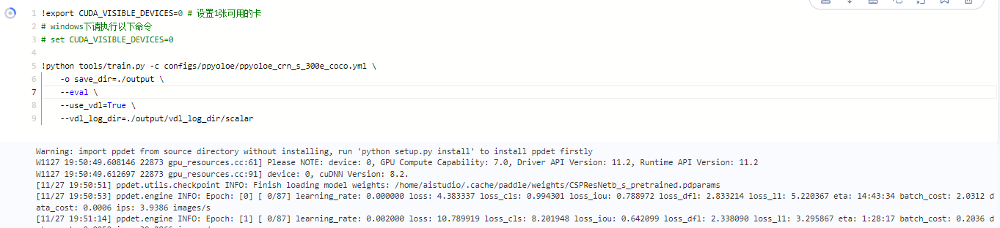

## (4.3) 主要训练参数说明

| 主要参数名    | 用途                                                         | 是否必选项 | 默认值             |
| :------------ | :----------------------------------------------------------- | :--------- | :----------------- |
| -c            | 指定训练模型的yaml文件                                       | 是         | 无                 |
| -o            | 修改yaml中的一些训练参数值                                   | 否         | 无                 |
| -r            | 指定模型参数进行继续训练                                     | 否         | 无                 |
| -o save_dir   | 修改yaml中模型保存的路径(不使用该参数，默认保存在output目录下) | 否         | output             |
| --eval        | 指定训练时是否边训练边评估                                   | 否         | -                  |
| --use_vdl     | 指定训练时是否使用visualdl记录数据                           | 否         | False              |
| --vdl_log_dir | 指定visualdl日志文件的保存路径                               | 否         | vdl_log_dir/scalar |
| --slim_config | 指定裁剪/蒸馏等模型减小的配置                                | 否         | 无                 |
| --amp         | 启动混合精度训练                                             | 否         | False              |

## (4.4) 多卡训练

​		如果想要使用多卡训练的话，需要将环境变量`CUDA_VISIBLE_DEVICES`指定为多卡（不指定时默认使用所有的`gpu`)，并使用`paddle.distributed.launch`启动训练脚本（`windows`下由于不支持`nccl`，无法使用多卡训练）:

```bash
export CUDA_VISIBLE_DEVICES=0,1,2,3 # 设置4张可用的卡
python tools/train.py -c configs/ppyoloe/ppyoloe_crn_s_300e_coco.yml \
    -o save_dir=./output \
    --eval \
    --use_vdl=True \
    --vdl_log_dir=./output/vdl_log_dir/scalar
```

​		执行效果:

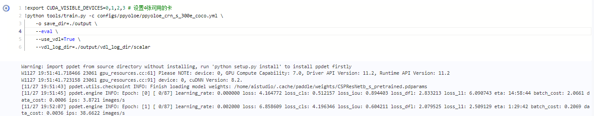

## (4.5) 恢复训练

```bash
python tools/train.py -c configs/ppyoloe/ppyoloe_crn_s_300e_coco.yml \
	-r ./output/ppyoloe_crn_s_300e_coco/39 \
    -o save_dir=./output \
    --eval \
    --use_vdl=True \
    --vdl_log_dir=./output/vdl_log_dir/scalar
```

​		执行效果:

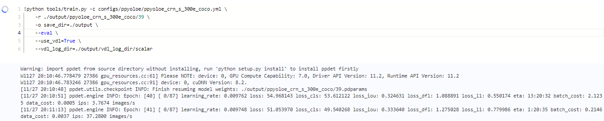

## (4.6) 训练可视化

​		`PaddleDetection`会将训练过程中的数据写入`VisualDL`文件，并实时的查看训练过程中的日志，记录的数据包括：

1. 当前计算各种损失的变化趋势
2. 日志记录时间
3. `mAP`变化趋势（当打开了`do_eval`开关后生效）

使用如下命令启动`VisualDL`查看日志

```bash
# 下述命令会在127.0.0.1上启动一个服务，支持通过前端web页面查看，可以通过--host这个参数指定实际ip地址
visualdl --logdir ./output/vdl_log_dir/scalar
```

在浏览器输入提示的网址，效果如下：

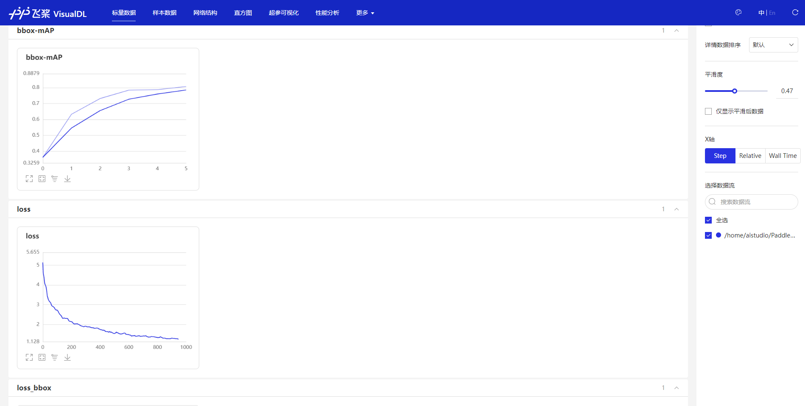

# (5) 模型验证与预测

## (5.1) 开始验证

​		训练完成后，用户可以使用评估脚本`tools/eval.py`来评估模型效果。假设训练过程中迭代轮次（`epoch`）为20，保存模型的间隔为10，即每迭代10次数据集保存1次训练模型。因此一共会产生2个定期保存的模型，加上保存的最佳模型`best_model`，一共有3个模型，可以通过`-o weights`指定期望评估的模型文件。

```bash
python tools/eval.py -c configs/ppyoloe/ppyoloe_crn_s_300e_coco.yml \
	-o use_gpu=true \
	-o weights=./output/ppyoloe_crn_s_300e_coco/39
```

​		执行效果:

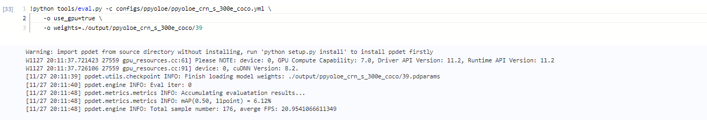

​		如果获取评估后各个类别的`PR`曲线图像，可通过传入`--classwise`进行开启。使用示例如下：

```bash
python tools/eval.py -c configs/ppyoloe/ppyoloe_crn_s_300e_coco.yml \
	-o use_gpu=true \
	-o weights=./output/ppyoloe_crn_s_300e_coco/39 \
	--classwise
```

​		图像保存在`PaddleDetection/voc_pr_curve`目录下，以下是其中一个类别的`PR`曲线图:

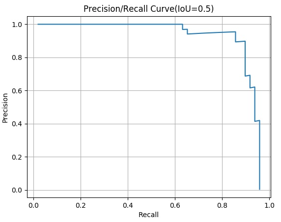

## (5.2) 主要验证参数说明

| 主要参数名             | 用途                                       | 是否必选项 | 默认值 |
| ---------------------- | ------------------------------------------ | ---------- | ------ |
| -c                     | 指定训练模型的yaml文件                     | 是         | 无     |
| -o                     | 修改yaml中的一些训练参数值                 | 是         | 无     |
| -o use_gpu             | 指定评估时是否采用gpu                      | 否         | false  |
| -o weights             | 指定评估时模型采用的模型参数               | 否         | 无     |
| --output_eval          | 指定一个目录保存评估结果                   | 否         | None   |
| --json_eval            | 指定一个bbox.json/mask.json用于评估        | 否         | False  |
| --slim_config          | 指定裁剪/蒸馏等模型减小的配置              | 否         | None   |
| --bias                 | 对于取得w和h结果加上一个偏置值             | 否         | 无     |
| --classwise            | 指定评估结束后绘制每个类别的AP以及PR曲线图 | 否         | -      |
| --save_prediction_only | 指定评估仅保存评估结果                     | 否         | False  |
| --amp                  | 指定评估时采用混合精度                     | 否         | False  |

**注意** 如果你想提升显存利用率，可以适当的提高 `num_workers` 的设置，以防`GPU`工作期间空等。

## (5.3) 评估指标说明

​		在目标检测领域中，评估模型质量主要是通过1个指标进行判断：`mAP`(平均精度)。

- `IOU`: 预测目标与真实目标的交并比

  

- `AP`: 单个类别PR曲线下的面积，其中`P`为精确度，`R`为召回率。

  

- `TP`: 预测目标的IOU>设定的某一个`IOU`阈值且预测正确时的检测框数量

- `FP`: 预测目标的IOU<设定的某一个`IOU`阈值且预测正确时/与单个真实框匹配后多余出来满足阈值的检测框数量

- `FN`: 没有检测到的真实框的数量

- `mAP`: 所有类别的AP的平均值

随着评估脚本的运行，最终打印的评估日志如下。(此时`VOC`指标计算的`IOU`阈值为0.5)

```bash
[11/27 20:11:39] ppdet.utils.checkpoint INFO: Finish loading model weights: ./output/ppyoloe_crn_s_300e_coco/39.pdparams
[11/27 20:11:40] ppdet.engine INFO: Eval iter: 0
[11/27 20:11:48] ppdet.metrics.metrics INFO: Accumulating evaluatation results...
[11/27 20:11:48] ppdet.metrics.metrics INFO: mAP(0.50, 11point) = 6.12%
[11/27 20:11:48] ppdet.engine INFO: Total sample number: 176, averge FPS: 20.9541066611349
```

## (5.4) 开始预测

​		除了可以分析模型的准确率指标之外，我们还可以对一些具体样本的预测效果，从`Bad Case`启发进一步优化的思路。

​		`tools/infer.py`脚本是专门用来可视化预测案例的，命令格式如下所示：

```bash
python tools/infer.py -c configs/ppyoloe/ppyoloe_crn_s_300e_coco.yml \
	-o use_gpu=true \
	-o weights=./output/ppyoloe_crn_s_300e_coco/39 \
	--infer_img ./dataset/roadsign_voc/images/road470.png \
	--output_dir ./output
```

​		执行效果:

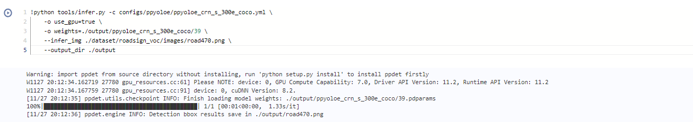

​		其中`--infer_img`是一张图片的路径，还可以用`--infer_dir`指定一个包含图片的目录，这时候将对该图片或文件列表或目录内的所有图片进行预测并保存可视化结果图。以下是预测的效果图:

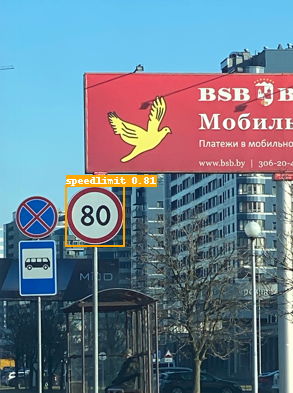

如果需要保存预测结果`bbox.json`文件，可以使用以下指令:

```bash
python tools/infer.py -c configs/ppyoloe/ppyoloe_crn_s_300e_coco.yml \
	-o use_gpu=true \
	-o weights=./output/ppyoloe_crn_s_300e_coco/39 \
	--infer_img ./dataset/roadsign_voc/images/road470.png \
    --output_dir ./output \
    --save_results=True
```

另外如果需要使用切片进行小目标检测时，可以通过以下指令进行:

```bash
python tools/infer.py -c configs/ppyoloe/ppyoloe_crn_s_300e_coco.yml \
	-o use_gpu=true \
	-o weights=./output/ppyoloe_crn_s_300e_coco/39 \
	--infer_img ./dataset/roadsign_voc/images/road470.png \
    --output_dir ./output \
    --save_results=True \
    --slice_infer \
    --slice_size 320 320
```

其中`--slice_infer`开启切片，`--slice_size`设置切片大小。

## (5.5) 主要预测参数说明

| 主要参数名        | 用途                                                         | 是否必选项 | 默认值            |
| ----------------- | ------------------------------------------------------------ | ---------- | ----------------- |
| -c                | 指定训练模型的yaml文件                                       | 是         | 无                |
| -o                | 修改yaml中的一些训练参数值                                   | 是         | 无                |
| -o use_gpu        | 指定评估时是否采用gpu                                        | 否         | False             |
| -o weights        | 指定评估时模型采用的模型参数                                 | 否         | 无                |
| --visualize       | 指定预测结果要进行可视化                                     | 否         | True              |
| --output_dir      | 指定预测结果保存的目录                                       | 否         | None              |
| --draw_threshold  | 指定预测绘图时的得分阈值                                     | 否         | 0.5               |
| --slim_config     | 指定裁剪/蒸馏等模型减小的配置                                | 否         | None              |
| --use_vdl         | 指定预测时利用visualdl将预测结果(图像)进行记录               | 否         | False             |
| --vdl_log_dir     | 指定visualdl日志文件保存目录                                 | 否         | vdl_log_dir/image |
| --save_results    | 指定预测结果要进行保存                                       | 否         | False             |
| --slice_infer     | 指定评估时采用切片进行预测评估(对于smalldet采用)             | 否         | -                 |
| --slice_size      | 指定评估时的切片大小(以下指令均上一个指令使用时有效)         | 否         | [640,640]         |
| --overlap_ratio   | 指定评估时的切片图像的重叠高度比率(上一个指令使用时有效)     | 否         | [0.25,0.25]       |
| --combine_method  | 指定评估时的切片图像检测结果的整合方法，支持: nms, nmm, concat | 否         | nms               |
| --match_threshold | 指定评估时的切片图像检测结果的整合匹配的阈值，支持: 0-1.0    | 否         | 0.6               |
| --match_metric    | 指定评估时的切片图像检测结果的整合匹配的指标(支持)，支持: iou,ios | 否         | ios               |

## (5.6) 输出说明

- 当你指定输出位置`--output_dir ./output`后，在默认文件夹`output`下将生成与预测图像同名的预测结果图像:

```bash
# 预测图像image1.png
|--output
|	|--模型权重输出文件夹
|		|...
|	|...
|	|--bbox.json
|	|--image1.png
```

# (6) 模型部署与转化

- 待补充

# (7) 配置文件说明

​		正是因为有配置文件的存在，我们才可以使用更便捷的进行消融实验。在本章节中我们选择
```configs/ppyoloe/ppyoloe_crn_s_300e_coco.yml```文件来进行配置文件的详细解读。

## (7.1) 整体配置文件格式综述

我们将```ppyoloe_crn_s_300e_coco.yml```进行拆分解释

* **ppyoloe** 表示模型的名称
* **crn** 表示模型骨干网络，即CSPResNet模型
* **s** 表示模型类型系列，即small系列模型
* **300e** 表示模型默认训练轮次
* **coco** 表示模型配置文件默认基于`coco`数据集训练，本文中的示例采用`voc.yml`来支持`voc`数据集的训练

**配置文件示例说明**

当前`PaddleDetection`为了降低配置冗余，将配置文件打散。要实现一个模型的训练，往往需要多个配置文件才可运行，如，我们现在选择的`ppyoloe_crn_s_300e_coco.yml`，需要逐层依赖`../datasets/coco_detection.yml`、`_base_/ppyoloe_crn.yml`、`_base_/optimizer_300e.yml` 、`_base_/ppyoloe_reader.yml`、`../runtime.yml`。

如果遇到相同的配置项，则直接使用的文件的地位最高，依赖文件越往后地位递减——即主配置文件优先级最高。

由于每个模型对于依赖文件的情况大致相同，因此以`yolov3`模型的所有配置文件展开示意图为例对本文所实验的模型进行说明:


一个模型的配置文件按功能可以分为:

- **主配置文件入口**: `ppyoloe_crn_s_300e_coco.yml`
- **定义训练数据路径的配置文件**:` ../datasets/coco_detection.yml`
  - 本文中替换为`voc.yml`以支持该模型以`voc`数据集进行训练
- **定义公共参数的配置文件**: `../runtime.yml`
- **定义优化器策略的配置文件**: `_base_/optimizer_300e.yml`
- **定义模型和主干网络的配置文件**: `_base_/ppyoloe_crn.yml`
- **定义数据预处理方式的配置文件**: `_base_/ppyoloe_reader.yml`

## (7.2) 数据路径与数据预处理说明

​		这一小节主要是说明数据部分，当准备好数据，如何进行配置文件修改，以及该部分的配置文件有什么内容。

**首先是进行数据路径配置**

数据为`VOC`格式数据集时，采用```../datasets/voc.yml```配置, 并按照以下修改路径即可。

```yaml
metric: VOC # VOC数据集评价指标: 支持VOC与COCO两种
map_type: 11point # VOC评价指标的类型: 支持11point(插值)与integral(积分)两种
num_classes: 4 # 数据的分类数(不包含类别背景)

TrainDataset: # 训练数据集配置
  !VOCDataSet
    dataset_dir: dataset/roadsign_voc # 1.数据集所在根目录
    anno_path: train.txt # 2.标注记录的txt: 即dataset/roadsign_voc/train.txt
    label_list: label_list.txt # 3.类别记录的txt: 即dataset/roadsign_voc/label_list.txt
    data_fields: ['image', 'gt_bbox', 'gt_class', 'difficult']

EvalDataset: # 验证数据集配置
  !VOCDataSet
    dataset_dir: dataset/roadsign_voc # 1.数据集所在根目录
    anno_path: valid.txt # 2.标注记录的txt: 即dataset/roadsign_voc/valid.txt
    label_list: label_list.txt # 3.类别记录的txt: 即dataset/roadsign_voc/label_list.txt
    data_fields: ['image', 'gt_bbox', 'gt_class', 'difficult']

TestDataset: # 预测数据集配置
  !ImageFolder
    anno_path: dataset/roadsign_voc/label_list.txt # 预测支持的类别记录的txt: 即dataset/roadsign_voc/label_list.txt
```

数据为`COCO`格式数据集时，采用```../datasets/coco_detection.yml```配置, 并按照以下修改路径即可。

```yaml
metric: COCO # COCO数据集评价指标: 支持VOC与COCO两种
num_classes: 80 # 数据的分类数(不包含类别背景)

TrainDataset: # 训练数据集配置
  !COCODataSet
    image_dir: train2017 # 3.图像目录: 即dataset/coco/train2017
    anno_path: annotations/instances_train2017.json # 2.标注记录的json: 即dataset/coco/annotations/instances_train2017.json
    dataset_dir: dataset/coco # 1.数据集所在根目录
    data_fields: ['image', 'gt_bbox', 'gt_class', 'is_crowd']

EvalDataset: # 验证数据集配置
  !COCODataSet
    image_dir: val2017 # 3.图像目录: 即dataset/coco/val2017
    anno_path: annotations/instances_val2017.json # 2.标注记录的json: 即dataset/coco/annotations/instances_val2017.json
    dataset_dir: dataset/coco # 1.数据集所在根目录

TestDataset: # 预测数据集配置
  !ImageFolder
    anno_path: annotations/instances_val2017.json # 2.标注记录的json: 即dataset/coco/annotations/instances_val2017.json
    dataset_dir: dataset/coco # 1.数据集所在根目录
```

**Note**

* 关于如何正确来写数据集的路径是非常关键的，可以根据上一章节训练的过程推演相对文件夹路径。

* ``num_classes``默认不包括背景类别。

* 根据自身数据集格式自行选择定义训练数据路径的配置文件，然后替换模型中原始数据路径的配置文件即可

  * ```yaml
    _BASE_: [
      '../datasets/voc.yml',
      '../runtime.yml',
      './_base_/optimizer_300e.yml',
      './_base_/ppyoloe_crn.yml',
      './_base_/ppyoloe_reader.yml',
    ]
    ```

* 以上是`ppyoloe_crn_s_300e_coco.yml`中的修改位置

**进一步地，可以根据需要配置数据预处理**

在`ppyoloe_crn_s_300e_coco.yml`中采用的数据预处理配置文件为: `_base_/ppyoloe_reader.yml`

```yaml
worker_num: 4 # 每张GPU reader进程个数
eval_height: &eval_height 640 # 评估输入图像的高，也是预测和模型导出时的模型输入图像大小
eval_width: &eval_width 640 # 评估输入图像的宽，也是预测和模型导出时的模型输入图像大小
eval_size: &eval_size [*eval_height, *eval_width] # 评估输入大小

TrainReader: # 训练读取器配置
  sample_transforms: # 采样预处理
    - Decode: {} # 读取图片并解码为图像数据
    - RandomDistort: {} # 对图像进行随机像素内容变换
    - RandomExpand: {fill_value: [123.675, 116.28, 103.53]} # 随机扩充
    - RandomCrop: {} # 随机裁剪
    - RandomFlip: {} # 随机翻转
  batch_transforms: # 批量预处理
    - BatchRandomResize: {target_size: [320, 352, 384, 416, 448, 480, 512, 544, 576, 608, 640, 672, 704, 736, 768], random_size: True, random_interp: True, keep_ratio: False} # 批量随机缩放
    - NormalizeImage: {mean: [0.485, 0.456, 0.406], std: [0.229, 0.224, 0.225], is_scale: True} # 归一化图像
    - Permute: {} # 通道提前: 保证为(C,H,W)
    - PadGT: {} # 真实框填充
  batch_size: 8 # 训练的数据批大小
  shuffle: true # 随机打乱采集的数据顺序
  drop_last: true # 每个轮次数据采集中最后一次批数据采集数量小于batch_size时进行丢弃
  use_shared_memory: true # 使用共享内存
  collate_batch: true # 表示reader是否对gt进行组batch的操作

EvalReader: # 评估读取器配置
  sample_transforms: # 采样预处理
    - Decode: {} # 读取图片并解码为图像数据
    - Resize: {target_size: *eval_size, keep_ratio: False, interp: 2} # 图像缩放
    - NormalizeImage: {mean: [0.485, 0.456, 0.406], std: [0.229, 0.224, 0.225], is_scale: True} # 图像归一化
    - Permute: {} # 通道提前: 保证为(C,H,W)
  batch_size: 2 # 评估的数据批大小

TestReader: # 预测读取器配置
  inputs_def: # 预测的输入定义
    image_shape: [3, *eval_height, *eval_width] # 输入大小定义
  sample_transforms: # 采样预处理
    - Decode: {} # 读取图片并解码为图像数据
    - Resize: {target_size: *eval_size, keep_ratio: False, interp: 2} # 图像缩放
    - NormalizeImage: {mean: [0.485, 0.456, 0.406], std: [0.229, 0.224, 0.225], is_scale: True} # 图像归一化
    - Permute: {} # 通道提前: 保证为(C,H,W)
  batch_size: 1 # 预测的数据批大小
```

**Note**

* 让模型评估采用不同的大小，可以修改一开始的`eval_height`和`eval_width`来实现
* `PaddleDetection`提供了多种数据增强的方式，可以通过访问[数据增强说明](https://github.com/PaddlePaddle/PaddleDetection/blob/release/2.5/docs/advanced_tutorials/READER.md#3.%E6%95%B0%E6%8D%AE%E9%A2%84%E5%A4%84%E7%90%86)来进行后续的修改。

## (7.3) 模型与损失函数说明

当我们配置好数据后，下面在看关于模型和主干网络的选择(位于`_base_/ppyoloe_crn.yml`中)

``` yaml
architecture: YOLOv3 # 模型架构名称
norm_type: sync_bn # 模型中归一化层的类型
use_ema: true # 是否使用ema平均
ema_decay: 0.9998 # ema衰减因子
ema_black_list: ['proj_conv.weight'] # 指定参数列表不参与ema计算
custom_black_list: ['reduce_mean'] # 指定参数列表不参与amp计算时算子参数的float16精度转换

YOLOv3: # 模型架构的配置
  backbone: CSPResNet # 骨干网络
  neck: CustomCSPPAN # Neck特征融合网络
  yolo_head: PPYOLOEHead # 检测输出头网络
  post_process: ~ # 空的独立后处理

CSPResNet: # 骨干网络配置
  layers: [3, 6, 6, 3] # 每个stage的基础通道数
  channels: [64, 128, 256, 512, 1024] # 进入第0个stage前的通道数以及每个stage输出特征的通道数
  return_idx: [1, 2, 3] # 用于检测的特征对应的stage索引号
  use_large_stem: True # 使用大的stem层作为输入特征的提取模块

CustomCSPPAN: # Neck特征融合网络配置
  out_channels: [768, 384, 192] # 输出特征的通道数
  stage_num: 1 # 堆叠stage的数量
  block_num: 3 # 每个中的基本模块数量
  act: 'swish' # 使用swish激活函数
  spp: true # 使用SPP金字塔结构

PPYOLOEHead: # 检测输出头网络配置
  fpn_strides: [32, 16, 8] # fpn对于输入特征对应的下采样步长/比例
  grid_cell_scale: 5.0 # 训练时由特征网格生成anchor时网格的尺度比例
  grid_cell_offset: 0.5 # 训练时由特征网格生成anchor时网格的偏移值
  static_assigner_epoch: 100 # 训练静态标签分配器的轮次
  use_varifocal_loss: True # 使用varifocal_loss损失函数
  loss_weight: {class: 1.0, iou: 2.5, dfl: 0.5} # 损失权重系数
  static_assigner: # 静态标签分配器
    name: ATSSAssigner
    topk: 9
  assigner: # 标签分配器
    name: TaskAlignedAssigner
    topk: 13
    alpha: 1.0
    beta: 6.0
  nms: # 非极大值抑制后处理模块
    name: MultiClassNMS # NMS名称
    nms_top_k: 1000 # 基于 score_threshold 的过滤检测后，根据置信度保留的最大检测框数量
    keep_top_k: 300 # 经过NMS抑制后, 最终保留的最大检测框数量。如果设置为 -1 ，则保留全部
    score_threshold: 0.01 # 过滤掉低置信度分数的边界框的阈值
    nms_threshold: 0.7 # 过滤掉其它与置信度最高的边界框的IoU大于该阈值的候选框
```

  **Note**

* 我们模型的`architecture`是`YOLOv3`
* 主干网络是 `CSPResNet`
* `nms` 此部分内容是预测与评估的后处理，一般可以根据需要调节`threshold`参数来优化处理效果。

## (7.4) 优化器说明

当我们配置好数据与模型后，下面再看关于优化器的选择(位于`_base_/optimizer_300e.yml`)

``` yaml
epoch: 300 # 训练轮次

LearningRate: # 学习率
  base_lr: 0.01 # 基础学习率大小——单卡GPU需要除以8
  schedulers: # 学习率策略
    - !CosineDecay # 余弦衰减策略
      max_epochs: 360
    - !LinearWarmup # 线性预热策略
      start_factor: 0.
      epochs: 5 # 预热为5轮次迭代

OptimizerBuilder: # 优化器构建部分
  optimizer: # 优化器
    momentum: 0.9 # 动量大小
    type: Momentum # 优化器类型
  regularizer: # 正则配置
    factor: 0.0005 # 正则大小
    type: L2 # L2正则类型
```

## (7.5) 其它参数说明

``` yaml
_BASE_: [
  '../datasets/voc.yml',
  '../runtime.yml',
  './_base_/optimizer_300e.yml',
  './_base_/ppyoloe_crn.yml',
  './_base_/ppyoloe_reader.yml',
] # 基础依赖的配置文件

# 是否寻找没用上的模型参数
find_unused_parameters: True
# 是否使用ema平均
use_ema: true

...

use_gpu: true # 使用GPU
use_xpu: false # 使用xpu
log_iter: 20 # 日志输出间隔
save_dir: output # 模型文件保存路径
snapshot_epoch: 1 # 快照输出频率(包括模型保存与评估)
print_flops: false # 打印flops

export: # 模型导出的配置
  post_process: True  # 导出时保留后处理
  nms: True           # 后处理中保留nms
  benchmark: False    # 不按照benchmark标准导出
  fuse_conv_bn: False # 不采用fuse_conv_bn
```

# (8) 部分参数值推荐说明

## (8.1) 训练批大小

```yaml
batch_size: 8
```

​		批大小(batch_size)通常取值: **32, 64, 128, 256, 512**。

​		一般可以按照数据集中训练的样本(图像)数量大小以及期望一轮训练迭代次数来大致取值(大模型之所以取较小的batch_size有一方面原因是因为模型本身显存占用更大)。

- 如果数据集训练样本数量为: `N`
- 期望一轮训练迭代次数为: `I`
- 得到大致`batch_size`大小: `B = N/I`

如果B大于32小于64，则可以选32；以此类推。

**Note**

- `batch_size`会收显存大小影响，因此过大的批大小可能大致运行训练失败——因为GPU显存不够。
- `batch_size` 是训练神经网络中的一个重要的超参数，该值决定了一次将多少数据送入神经网络参与训练。论文 [Accurate, Large Minibatch SGD: Training ImageNet in 1 Hour](https://arxiv.org/abs/1706.02677)，当 `batch size` 的值与学习率的值呈线性关系时，收敛精度几乎不受影响。在训练 ImageNet 数据时，大部分的神经网络选择的初始学习率为 0.1，`batch size` 是 256，所以根据实际的模型大小和显存情况，可以将学习率设置为 0.1*k, batch_size 设置为 256*k。在实际任务中，也可以将该设置作为初始参数，进一步调节学习率参数并获得更优的性能。
- 拟合效果不好时，可以适当增大`batch_size`的大小以改善短期的训练效果；若存在过拟合，则可以尝试采用小一些的`batch_size`——注意，此时训练轮次一般可以不改变，但是可能存在训练最优轮次提前出现或者延后出现。

## (8.2) 训练轮次大小

```bash
epoch: 300
```

​		轮次(`epochs`)通常取值: **300, 500, 650, 1300。**

​		如果取300轮效果不理想，可以用350轮尝试，如果效果有提升则可以用大的训练轮次进行训练。

## (8.3) 训练学习率大小

```yaml
base_lr: 0.01
```

​		学习率(`learning_rate`)通常取配置文件的默认值，如果性能不好，可以尝试调小或调大，公式: $new\_lr=lr * ratio$。其中调小时: `ratio`可以取`0.5`或者`0.1`；而调大时:  `ratio`可以取或`1.0`者`2.0`。但学习率一般不超过1.0，否则容易训练不稳定。

​		如果配置文件所对应的模型默认为N卡训练的模型，则需要对学习率除以卡数N: $new\_lr=lr / N$。

​		由于本模型默认为8卡训练的，因此如果是在单卡上训练该模型需要修改学习率为`0.00125`。

## (8.4) 训练预热迭代轮次

```yaml
- !LinearWarmup
    start_factor: 0.
    epochs: 5
```

​		预热迭代轮次(epochs)一般取总迭代轮次的`1/20`或`1/15`。

## (8.5)评估时的NMS参数设置

```yaml
nms:
    name: MultiClassNMS
    nms_top_k: 1000
    keep_top_k: 300
    score_threshold: 0.01
    nms_threshold: 0.7
```

- `nms_top_k`与`keep_top_k`一般不修改——均改小可以实现`NMS`实际处理的数量减小。
- 可以提高`score_threshold`来进行第一轮筛选，丢弃大部分不满足该阈值的目标——对于轻量模型采用`0.05`左右的较小阈值，因此轻量模型性能有限，大部分目标得分可能较低，避免漏检。反之，采用大阈值对大模型起到抑制作用，避免过度识别。(具体适用值需要根据模型实际性能进行调整)
- `nms_threshold`可以对重叠目标进行筛选，一般取在`0.45-0.7`之间。