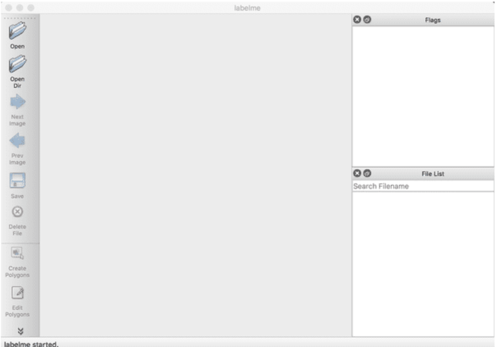
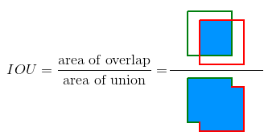
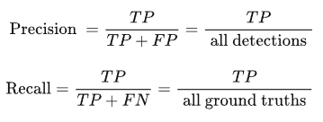

# 概述

本文重点介绍如何利用飞桨目标检测套件**PaddleDetection**在路标检测数据上，使用当前PaddleDetection主推的PP-PicoDet模型进行详细讲解。
PP-PicoDet模型是PaddleDetection团队自研的轻量级目标检测模型，模型结构如下。

PP-PicoDet模型更详细的原理介绍请参考[官网链接](https://github.com/PaddlePaddle/PaddleDetection)。

## 文章目录结构

- 1 环境安装
  - 1.1 PaddlePaddle安装
    - 1.1.1 安装对应版本PaddlePaddle
    - 1.1.2 验证安装是否成功
  - 1.2 PaddleDetection安装
    - 1.2.1 下载PaddleDetection代码
    - 1.2.2 安装依赖项目
    - 1.2.3 验证安装是否成功
- 2 数据准备
  - 2.1 数据标注
    - 2.1.1 LabelMe安装
    - 2.1.2 LabelMe的使用
  - 2.2 数据格式转化
  - 2.3 数据划分
- 3 模型训练、验证与预测
  - 3.1 模型训练参数说明
    - 3.1.1 训练前数据准备
    - 3.1.2 开始训练
    - 3.1.3 训练参数解释
    - 3.1.4 恢复训练
    - 3.1.5 训练可视化
  - 3.2 模型验证参数说明
    - 3.2.1 评估操作
    - 3.2.2 评估方式说明
  - 3.3 模型预测
    - 3.3.1 准备预测数据
    - 3.3.2 输出文件说明
- 4 配置文件的说明
  - 4.1 整体配置文件格式综述
  - 4.2 数据路径与数据预处理说明
  - 4.3 模型与损失函数说明
  - 4.4 优化器说明
  - 4.5 其它参数说明


# 1 环境安装

## 1.1 PaddlePaddle安装

### 1.1.1 安装对应版本PaddlePaddle

根据系统和设备的cuda环境，选择对应的安装包，这里默认使用pip在linux设备上进行安装。

在终端执行

```
pip install paddlepaddle-gpu==2.3.0.post110 -f https://www.paddlepaddle.org.cn/whl/linux/mkl/avx/stable.html
```

### 1.1.2 验证安装是否成功

``` bash
# 安装完成后您可以使用 python进入python解释器，
python
# 继续输入
import paddle 
# 再输入 
paddle.utils.run_check()
```

如果出现PaddlePaddle is installed successfully!，说明您已成功安装。

## 1.2 PaddleDetection安装

### 1.2.1 下载PaddleDetection代码

用户可以通过使用github或者gitee的方式进行下载，我们当前版本为PaddleDetection的release v2.5版本。后续在使用时，需要对应版本进行下载。


``` bash
# github下载
git clone https://github.com/PaddlePaddle/PaddleDetection.git
# gitee下载
git clone https://gitee.com/PaddlePaddle/PaddleDetection.git
```

### 1.2.2 安装依赖项目

* 方式一：
  通过直接pip install 安装，可以最高效率的安装依赖

``` bash
pip install paddledet
```

* 方式二：
  下载PaddleDetection代码后，进入PaddleDetection代码文件夹目录下面

``` bash
cd PaddleDetection
pip install -r requirements.txt
```

### 1.2.3 验证安装是否成功

在PaddleDetection目录下执行如下命令，会进行简单的单卡训练和单卡预测。

等待模型下载以及查看执行日志，若没有报错，则验证安装成功。

``` bash
python tools/infer.py -c configs/ppyolo/ppyolo_r50vd_dcn_1x_coco.yml -o use_gpu=true weights=https://paddledet.bj.bcebos.com/models/ppyolo_r50vd_dcn_1x_coco.pdparams --infer_img=demo/000000014439.jpg
```

# 2 数据准备

## 2.1 数据标注

无论是语义分割，实例分割，还是目标检测，我们都需要充足的训练数据。如果你想使用没有标注的原始数据集做目标检测任务，你必须先为原始图像作出标注。

### 2.1.1 LabelMe安装


用户在采集完用于训练、评估和预测的图片之后，需使用数据标注工具[LabelMe](https://github.com/wkentaro/labelme)完成数据标注。

LabelMe支持在Windows/macOS/Linux三个系统上使用，且三个系统下的标注格式是一样。具体的安装流程请参见[官方安装指南](https://github.com/wkentaro/labelme)。

### 2.1.2 LabelMe的使用

打开终端输入`labelme`会出现LableMe的交互界面，可以先预览`LabelMe`给出的已标注好的图片，再开始标注自定义数据集。

<div align=center></div>

<div align="center">
    <p>图1 LableMe交互界面的示意图</p>
 </div>

   * 开始标注

请按照下述步骤标注数据集：

​        (1)   点击`OpenDir`打开待标注图片所在目录，点击`Create Polygons`，然后鼠标右键选择 create Retangle 沿着目标构建矩形框，绘制好区域后按下回车，然后输入目标的类别。在标注过程中，如果某一个矩形框画错了，可以按撤销快捷键可撤销该矩形框。Windows/Mac下的撤销快捷键为`command+Z`。(在选定矩形框后，后续只要不重新点击Create Polygons均保持为矩形框绘制)

<div align=center></div>

<div align="center">
    <p>图2 选择矩形框进行目标框选的示意图</p>
 </div>

​		(2)   右击选择`Edit Polygons`可以整体移动矩形的位置，可以调整矩形大小，也可以选中后右键点击删除该的位置；右击选择`Edit Label还可以修改每个目标的类别。请根据自己的需要执行这一步骤，若不需要修改，可跳过。

<div align=center></div>

<div align="center">
    <p>图3 点击Edit Ploygons后移动调整标注的示意图</p>
 </div>

<div align=center></div>

<div align="center">
    <p>图4 点击Edit Ploygons后右键选中删除标注的示意图</p>
 </div>

(3)   图片中所有目标的标注都完成后，点击`Save`保存json文件，**请将json文件和图片放在同一个文件夹里**，点击`Next Image`标注下一张图片(标注save完成后右侧图像原始路径旁会打勾)。

<div align=center></div>

<div align="center">
    <p>图5 点击Save保存后点击下一张标注图像的示意图</p>
 </div>

<div align=center></div>

<div align="center">
    <p>图5 标注结果的示意图</p>
 </div>

## 2.2 数据格式转化

PaddleX做为飞桨全流程开发工具，提供了非常多的工具，在这里我们使用paddlex进行数据格式转化。
首先安装paddlex

```bash
pip install paddlex
```

目前所有标注工具生成的标注文件，均为与原图同名的json格式文件，如`1.jpg`在标注完成后，则会在标注文件保存的目录中生成`1.json`文件。转换时参照以下步骤：

1. 将所有的原图文件放在同一个目录下，如`pics`目录  
2. 将所有的标注json文件放在同一个目录下，如`annotations`目录  
3. 使用如下命令进行转换:

```bash
paddlex --data_conversion --source labelme --to MSCOCO --pics ./pics --annotations ./annotations --save_dir ./converted_dataset_dir
```

| 参数          | 说明                                                         |
| ------------- | ------------------------------------------------------------ |
| --source      | 表示数据标注来源，支持`labelme`、`jingling`（分别表示数据来源于LabelMe，精灵标注助手） |
| --to          | 表示数据需要转换成为的格式，支持`ImageNet`（图像分类）、`PascalVOC`（目标检测），`MSCOCO`（实例分割，也可用于目标检测）和`SEG`(语义分割) |
| --pics        | 指定原图所在的目录路径                                       |
| --annotations | 指定标注文件所在的目录路径                                   |

- **note**非常重要！！！

  若图像与标注文件保存在同一个文件夹中，则只需保持`--pics`以及`--annotations`的路径参数一致即可

```bash
paddlex --data_conversion --source labelme --to MSCOCO --pics ./pics --annotations ./pics --save_dir ./converted_dataset_dir
```

​	另外，对于目标检测主要有两种数据集格式: COCO与VOC，上述转换为COCO转换。因此，如果需要转换为VOC，可采用以下指令:

```bash
paddlex --data_conversion --source labelme --to PascalVOC --pics ./pics --annotations ./pics --save_dir ./converted_dataset_dir
```


## 2.3 数据划分

在这里，我们依旧使用paddlex进行数据划分
使用paddlex命令即可将数据集随机划分成70%训练集，20%验证集和10%测试集:

(1.COCO格式数据的划分: 保证数据集已经由2.2中所述转为COCO格式数据集)

```bash
paddlex --split_dataset --format COCO --dataset_dir ./converted_dataset_dir --val_value 0.2 --test_value 0.1
```

执行上面命令行，会在`./converted_dataset_dir`下生成`train.json`, val.json`, `test.json，分别存储训练样本信息，验证样本信息，测试样本信息

至此我们的数据就创作完成了，最终我们的产出形态应如下所示

- 文件结构

  ```bash
  custom_dataset
  |
  |--JPEGImages
  |  |--image1.jpg
  |  |--image2.jpg
  |  |--...
  |
  |--...
  |
  |--train.json
  |
  |--val.json
  |
  |--test.json
  ```

- 文件夹命名为custom_dataset不是必须，用户可以自主进行命名。

- 其中`train.json`的内容如下所示：

  ```json
  root:
  	annotations:
  		0:
  			...
  			bbox:
  				0:62.19847328244276
                   1:163.22519083969465
                   2:125.95419847328242
                   3:123.66412213740458
               area:15576.015383718894
               category_id:1
               id:8
          1:
           	...
          ...
      images:
      	...
      categories:
      	...
  ```

(2.VOC格式数据的划分: 保证数据集已经由2.2中所述转为VOC格式数据集)

```bash
paddlex --split_dataset --format VOC --dataset_dir ./converted_dataset_dir --val_value 0.2 --test_value 0.1
```

执行上面命令行，会在`./converted_dataset_dir`下生成`labels.txt`, `train_list.txt`, `val_list.txt`, `test_list.txt`，分别存储类别信息，训练样本信息，验证样本信息，测试样本信息

至此我们的数据就创作完成了，最终我们的产出形态应如下所示

- 文件结构

  ```bash
  custom_dataset
  |
  |--Annotations
  |  |--image1.xml
  |  |--image2.xml
  |  |--...
  |
  |--JPEGImages
  |  |--image1.jpg
  |  |--image2.jpg
  |  |--...
  |
  |--...
  |
  |--labels.txt
  |
  |--train_list.txt
  |
  |--val_list.txt
  |
  |--test_list.txt
  ```

- 文件夹命名为custom_dataset不是必须，用户可以自主进行命名。

- 其中labels.txt的内容如下:

  ```bash
  class1
  class2
  ...
  ```

- 其中`train.txt`的内容如下所示：

  ```bash
  JPEGImages/image1.png Annotations/image1.xml
  JPEGImages/image2.png Annotations/image2.xml
  ...
  ```

  - **note**非常重要！！！

  我们一般推荐用户将数据集放置在PaddleDetection下的dataset文件夹下，下文配置文件的修改也是按照该方式。

  在本文中，后续配置将使用VOC数据集进行训练等步骤的展示。

# 3 模型训练与验证

## 3.1模型训练参数说明

### 3.1.1 训练前准备

我们可以通过PaddleDetection提供的脚本对模型进行训练，在本小节中我们使用`PP-PicoDet`模型与`Road Sign Detection`数据集展示训练过程。 在训练之前，最重要的修改自己的数据情况，确保能够正常训练。

在本项目中，我们使用```configs/picodet/picodet_s_416_coco_lcnet.yml```进行训练。

我们发现
`picodet_s_416_coco_lcnet.yml`，需要逐层依赖`../datasets/coco_detection.yml`、`_base_/picodet_v2.yml`、`_base_/optimizer_300e.yml` 、`_base_/picodet_416_reader.yml`、`../runtime.yml`。

由于后续使用数据为VOC格式数据，因此需要替换`picodet_s_416_coco_lcnet.yml`的依赖`../datasets/coco_detection.yml`为`../datasets/voc.yml`，然后再进行相应的数据配置修改，依赖修改如下:

```yaml
_BASE_: [
  '../datasets/voc.yml',
  '../runtime.yml',
  '_base_/picodet_v2.yml',
  '_base_/optimizer_300e.yml',
  '_base_/picodet_416_reader.yml',
]
...
```

在这里改动../datasets/voc.yml中文件的路径，修改为如下内容。

```yml
metric: VOC # VOC数据集评价指标: 支持VOC与COCO两种
map_type: 11point # VOC评价指标的类型: 支持11point(插值)与integral(积分)两种
num_classes: 4 # 数据的分类数(不包含类别背景)

TrainDataset: # 训练数据集配置
  !VOCDataSet
    dataset_dir: dataset/roadsign_voc # 1.数据集所在根目录
    anno_path: train.txt # 2.训练标注记录的txt: 即dataset/roadsign_voc/train.txt
    label_list: label_list.txt # 3.训练类别记录的txt: 即dataset/roadsign_voc/label_list.txt
    data_fields: ['image', 'gt_bbox', 'gt_class', 'difficult']

EvalDataset: # 验证数据集配置
  !VOCDataSet
    dataset_dir: dataset/roadsign_voc # 1.数据集所在根目录
    anno_path: valid.txt # 2.训练标注记录的txt: 即dataset/roadsign_voc/valid.txt
    label_list: label_list.txt # 3.训练类别记录的txt: 即dataset/roadsign_voc/label_list.txt
    data_fields: ['image', 'gt_bbox', 'gt_class', 'difficult']

TestDataset: # 预测数据集配置
  !ImageFolder
    anno_path: dataset/roadsign_voc/label_list.txt # 预测支持的类别记录的txt: 即dataset/roadsign_voc/label_list.txt
```

**note**非常重要！！！

* 关键改动的配置中的路径，这一个涉及相对路径，安照提示一步步来，确保最终能够完成。

* 本次项目中使用到的数据[下载链接](https://paddlemodels.bj.bcebos.com/object_detection/roadsign_voc.tar)，本章节将使用路标检测（Road Sign Detection）数据集进行训练，路标检测是一组不同路标组成的VOC格式数据集，包含了701张训练图片、176张验证图片、0张测试图片，包含4个类别: crosswalk，speedlimit，stop，trafficlight.(以下是目录结构)

```bash
|--roadsign_voc
|	|--annotations
|		|--image1.xml
|		|--...
|	|--images
|		|--image1.png
|		|--...
|	|--label_list.txt
|	|--train.txt
|	|--valid.txt
```

### 3.1.2 开始训练

请确保已经完成了PaddleDetection的安装工作，并且当前位于PaddleDetection目录下，执行以下脚本：

```bash
export CUDA_VISIBLE_DEVICES=0 # 设置1张可用的卡
# windows下请执行以下命令
# set CUDA_VISIBLE_DEVICES=0

python tools/train.py -c configs/picodet/picodet_s_416_coco_lcnet.yml \
    -o save_dir=./output \
    --eval \
    --use_vdl=True \
    --vdl_log_dir=./output/vdl_log_dir/scalar
```

### 3.1.3 训练参数解释

| 主要参数名    | 用途                                                         | 是否必选项 | 默认值             |
| :------------ | :----------------------------------------------------------- | :--------- | :----------------- |
| -c            | 指定训练模型的yaml文件                                       | 是         | 无                 |
| -o            | 修改yaml中的一些训练参数值                                   | 否         | 无                 |
| -r            | 指定模型参数进行继续训练                                     | 否         | 无                 |
| -o save_dir   | 修改yaml中模型保存的路径(不使用该参数，默认保存在output目录下) | 否         | output             |
| --eval        | 指定训练时是否边训练边评估                                   | 否         | -                  |
| --use_vdl     | 指定训练时是否使用visualdl记录数据                           | 否         | False              |
| --vdl_log_dir | 指定visualdl日志文件的保存路径                               | 否         | vdl_log_dir/scalar |
| --slim_config | 指定裁剪/蒸馏等模型减小的配置                                | 否         | 无                 |
| --amp         | 启动混合精度训练                                             | 否         | False              |


### 3.1.3 多卡训练

如果想要使用多卡训练的话，需要将环境变量CUDA_VISIBLE_DEVICES指定为多卡（不指定时默认使用所有的gpu)，并使用paddle.distributed.launch启动训练脚本（windows下由于不支持nccl，无法使用多卡训练）:

```bash
export CUDA_VISIBLE_DEVICES=0,1,2,3 # 设置4张可用的卡
python tools/train.py -c configs/picodet/picodet_s_416_coco_lcnet.yml \
    -o save_dir=./output \
    --eval \
    --use_vdl=True \
    --vdl_log_dir=./output/vdl_log_dir/scalar
```

### 3.1.4 恢复训练

```bash
python tools/train.py -c configs/picodet/picodet_s_416_coco_lcnet.yml \
	-r ./output/picodet_s_416_coco_lcnet/39 \
    -o save_dir=./output \
    --eval \
    --use_vdl=True \
    --vdl_log_dir=./output/vdl_log_dir/scalar
```

### 3.1.5 训练可视化

PaddleDetection会将训练过程中的数据写入VisualDL文件，并实时的查看训练过程中的日志，记录的数据包括：

1. 当前计算各种损失的变化趋势
2. 日志记录时间
3. mAP变化趋势（当打开了`do_eval`开关后生效）

使用如下命令启动VisualDL查看日志

```bash
# 下述命令会在127.0.0.1上启动一个服务，支持通过前端web页面查看，可以通过--host这个参数指定实际ip地址
visualdl --logdir output/
```

在浏览器输入提示的网址，效果如下：


## 3.2 模型验证参数说明

### 3.2.1 评估操作

训练完成后，用户可以使用评估脚本tools/eval.py来评估模型效果。假设训练过程中迭代轮次（epoch）为300，保存模型的间隔为10，即每迭代10次数据集保存1次训练模型。因此一共会产生1个定期保存的模型，加上保存的最佳模型`best_model`，一共有2个模型，可以通过`-o weights`指定期望评估的模型文件。

```bash
python tools/eval.py -c configs/picodet/picodet_s_416_coco_lcnet.yml \
	-o use_gpu=true \
	-o weights=./output/picodet_s_416_coco_lcnet/39
```

如果获取评估后各个类别的PR曲线图像，可通过传入--classwise进行开启。使用示例如下：

```bash
python tools/eval.py -c configs/picodet/picodet_s_416_coco_lcnet.yml \
	-o use_gpu=true \
	-o weights=./output/picodet_s_416_coco_lcnet/39 \
	--classwise
```

图像保存在PaddleDetection/voc_pr_curve目录下，以下是其中一个类别的PR曲线图:


- 参数说明如下

| 主要参数名             | 用途                                       | 是否必选项 | 默认值 |
| ---------------------- | ------------------------------------------ | ---------- | ------ |
| -c                     | 指定训练模型的yaml文件                     | 是         | 无     |
| -o                     | 修改yaml中的一些训练参数值                 | 是         | 无     |
| -o use_gpu             | 指定评估时是否采用gpu                      | 否         | false  |
| -o weights             | 指定评估时模型采用的模型参数               | 否         | 无     |
| --output_eval          | 指定一个目录保存评估结果                   | 否         | None   |
| --json_eval            | 指定一个bbox.json/mask.json用于评估        | 否         | False  |
| --slim_config          | 指定裁剪/蒸馏等模型减小的配置              | 否         | None   |
| --bias                 | 对于取得w和h结果加上一个偏置值             | 否         | 无     |
| --classwise            | 指定评估结束后绘制每个类别的AP以及PR曲线图 | 否         | -      |
| --save_prediction_only | 指定评估仅保存评估结果                     | 否         | False  |
| --amp                  | 指定评估时采用混合精度                     | 否         | False  |

**注意** 如果你想提升显存利用率，可以适当的提高 num_workers 的设置，以防GPU工作期间空等。

### 3.2.2 评估方式说明

在目标检测领域中，评估模型质量主要是通过1个指标进行判断：mAP(平均精度)。

- IOU: 预测目标与真实目标的交并比



- AP: 单个类别PR曲线下的面积，其中P为精确度，R为召回率。



- TP: 预测目标的IOU>设定的某一个IOU阈值且预测正确时的检测框数量
- FP: 预测目标的IOU<设定的某一个IOU阈值且预测正确时/与单个真实框匹配后多余出来满足阈值的检测框数量
- FN: 没有检测到的真实框的数量
- mAP: 所有类别的AP的平均值

随着评估脚本的运行，最终打印的评估日志如下。(此时VOC指标计算的IOU阈值为0.5)

```bash
...
[11/15 16:22:40] ppdet.utils.checkpoint INFO: Finish loading model weights: ./output/picodet_s_416_coco_lcnet/39.pdparams
[11/15 16:22:42] ppdet.engine INFO: Eval iter: 0
[11/15 16:22:44] ppdet.metrics.metrics INFO: Accumulating evaluatation results...
[11/15 16:22:44] ppdet.metrics.metrics INFO: mAP(0.50, 11point) = 78.42%
[11/15 16:22:44] ppdet.engine INFO: Total sample number: 176, averge FPS: 44.14290677539102
```

## 3.3 模型预测

除了分析模型的mAP指标之外，我们还可以查阅一些具体样本的检测样本效果，从Bad Case启发进一步优化的思路。

tools/infer.py脚本是专门用来可视化预测案例的，命令格式如下所示：

```bash
python tools/infer.py -c configs/picodet/picodet_s_416_coco_lcnet.yml \
	-o use_gpu=true \
	-o weights=./output/picodet_s_416_coco_lcnet/39 \
	--infer_img ./dataset/roadsign_voc/images/road470.png \
	--output_dir ./output
```

其中`--infer_img`是一张图片的路径，还可以用`--infer_dir`指定一个包含图片的目录，这时候将对该图片或文件列表或目录内的所有图片进行预测并保存可视化结果图。以下是预测的效果图:


如果需要保存预测结果bbox.json文件，可以使用以下指令:

```bash
python tools/infer.py -c configs/picodet/picodet_s_416_coco_lcnet.yml \
	-o use_gpu=true \
	-o weights=./output/picodet_s_416_coco_lcnet/39 \
	--infer_img ./dataset/roadsign_voc/images/road470.png \
    --output_dir ./output \
    --save_results=True
```

另外如果需要使用切片进行小目标检测时，可以通过以下指令进行:

```bash
python tools/infer.py -c configs/picodet/picodet_s_416_coco_lcnet.yml \
	-o use_gpu=true \
	-o weights=./output/picodet_s_416_coco_lcnet/39 \
	--infer_img ./dataset/roadsign_voc/images/road470.png \
    --output_dir ./output \
    --save_results=True \
    --slice_infer \
    --slice_size 320 320
```

其中--slice_infer开启切片，--slice_size设置切片大小。

- 参数说明如下

| 主要参数名        | 用途                                                         | 是否必选项 | 默认值            |
| ----------------- | ------------------------------------------------------------ | ---------- | ----------------- |
| -c                | 指定训练模型的yaml文件                                       | 是         | 无                |
| -o                | 修改yaml中的一些训练参数值                                   | 是         | 无                |
| -o use_gpu        | 指定评估时是否采用gpu                                        | 否         | False             |
| -o weights        | 指定评估时模型采用的模型参数                                 | 否         | 无                |
| --visualize       | 指定预测结果要进行可视化                                     | 否         | True              |
| --output_dir      | 指定预测结果保存的目录                                       | 否         | None              |
| --draw_threshold  | 指定预测绘图时的得分阈值                                     | 否         | 0.5               |
| --slim_config     | 指定裁剪/蒸馏等模型减小的配置                                | 否         | None              |
| --use_vdl         | 指定预测时利用visualdl将预测结果(图像)进行记录               | 否         | False             |
| --vdl_log_dir     | 指定visualdl日志文件保存目录                                 | 否         | vdl_log_dir/image |
| --save_results    | 指定预测结果要进行保存                                       | 否         | False             |
| --slice_infer     | 指定评估时采用切片进行预测评估(对于smalldet采用)             | 否         | -                 |
| --slice_size      | 指定评估时的切片大小(以下指令均上一个指令使用时有效)         | 否         | [640,640]         |
| --overlap_ratio   | 指定评估时的切片图像的重叠高度比率(上一个指令使用时有效)     | 否         | [0.25,0.25]       |
| --combine_method  | 指定评估时的切片图像检测结果的整合方法，支持: nms, nmm, concat | 否         | nms               |
| --match_threshold | 指定评估时的切片图像检测结果的整合匹配的阈值，支持: 0-1.0    | 否         | 0.6               |
| --match_metric    | 指定评估时的切片图像检测结果的整合匹配的指标(支持)，支持: iou,ios | 否         | ios               |

## 3.3.2 输出文件说明

当你指定输出位置--output_dir ./output后，在默认文件夹output下将生成与预测图像同名的预测结果图像:

```bash
# 预测图像image1.png
|--output
|	|--模型权重输出文件夹
|		|...
|	|...
|	|--bbox.json
|	|--image1.png
```

# 4 配置文件的说明

正是因为有配置文件的存在，我们才可以使用更便捷的进行消融实验。在本章节中我们选择
```configs/picodet/picodet_s_416_coco_lcnet.yml```文件来进行配置文件的详细解读

## 4.1 整体配置文件格式综述

我们将```picodet_s_416_coco_lcnet.yml```进行拆分解释

* **picodet** 表示模型的名称
* **s** 表示模型变种类型，即small变种模型
* **416** 表示模型训练的目标图像大小
* **coco** 表示模型配置文件默认基于coco数据集训练，本文中的示例采用voc.yml来支持voc数据集的训练
* **lcnet** 表示模型的骨干网络类型

**配置文件示例说明**

当前PaddleDetection为了降低配置冗余，将配置文件打散。要实现一个模型的训练，往往需要多个配置文件才可运行，如，我们现在选择的```picodet_s_416_coco_lcnet.yml```，需要逐层依赖`../datasets/coco_detection.yml`、`_base_/picodet_v2.yml`、`_base_/optimizer_300e.yml` 、`_base_/picodet_416_reader.yml`、`../runtime.yml`。

如果遇到相同的配置项，则直接使用的文件的地位最高，依赖文件越往后地位递减——即主配置文件优先级最高。

由于每个模型对于依赖文件的情况大致相同，因此以yolov3模型的所有配置文件展开示意图为例对本文所实验的模型进行说明:


一个模型的配置文件按功能可以分为:

- **主配置文件入口**: picodet_s_416_coco_lcnet.yml
- **定义训练数据路径的配置文件**: ../datasets/coco_detection.yml
  - 本文中替换为voc.yml以支持该模型以voc数据集进行训练
- **定义公共参数的配置文件**: ../runtime.yml
- **定义优化器策略的配置文件**: \_base\_/optimizer_300e.yml
- **定义模型和主干网络的配置文件**: \_base\_/picodet_v2.yml
- **定义数据预处理方式的配置文件**: \_base\_/picodet_416_reader.yml

## 4.2 数据路径与数据预处理说明

这一小节主要是说明数据部分，当准备好数据，如何进行配置文件修改，以及该部分的配置文件有什么内容。

**首先是进行数据路径配置**

数据为VOC格式数据集时，采用```../datasets/voc.yml```配置, 并按照以下修改路径即可。

``` yaml
metric: VOC # VOC数据集评价指标: 支持VOC与COCO两种
map_type: 11point # VOC评价指标的类型: 支持11point(插值)与integral(积分)两种
num_classes: 4 # 数据的分类数(不包含类别背景)

TrainDataset: # 训练数据集配置
  !VOCDataSet
    dataset_dir: dataset/roadsign_voc # 1.数据集所在根目录
    anno_path: train.txt # 2.训练标注记录的txt: 即dataset/roadsign_voc/train.txt
    label_list: label_list.txt # 3.训练类别记录的txt: 即dataset/roadsign_voc/label_list.txt
    data_fields: ['image', 'gt_bbox', 'gt_class', 'difficult']

EvalDataset: # 验证数据集配置
  !VOCDataSet
    dataset_dir: dataset/roadsign_voc # 1.数据集所在根目录
    anno_path: valid.txt # 2.训练标注记录的txt: 即dataset/roadsign_voc/valid.txt
    label_list: label_list.txt # 3.训练类别记录的txt: 即dataset/roadsign_voc/label_list.txt
    data_fields: ['image', 'gt_bbox', 'gt_class', 'difficult']

TestDataset: # 预测数据集配置
  !ImageFolder
    anno_path: dataset/roadsign_voc/label_list.txt # 预测支持的类别记录的txt: 即dataset/roadsign_voc/label_list.txt
```

数据为COCO格式数据集时，采用```../datasets/coco_detection.yml```配置, 并按照以下修改路径即可。

```yaml
metric: COCO # COCO数据集评价指标: 支持VOC与COCO两种
num_classes: 80 # 数据的分类数(不包含类别背景)

TrainDataset:
  !COCODataSet
    image_dir: train2017 # 3.训练图像目录: 即dataset/coco/train2017
    anno_path: annotations/instances_train2017.json # 2.标注记录的json: 即dataset/coco/annotations/instances_train2017.json
    dataset_dir: dataset/coco # 1.数据集所在根目录
    data_fields: ['image', 'gt_bbox', 'gt_class', 'is_crowd']

EvalDataset:
  !COCODataSet
    image_dir: val2017 # 3.训练图像目录: 即dataset/coco/val2017
    anno_path: annotations/instances_val2017.json # 2.标注记录的json: 即dataset/coco/annotations/instances_val2017.json
    dataset_dir: dataset/coco # 1.数据集所在根目录

TestDataset:
  !ImageFolder
    anno_path: annotations/instances_val2017.json # 2.标注记录的json: 即dataset/coco/annotations/instances_val2017.json
    dataset_dir: dataset/coco # 1.数据集所在根目录
```

**note**

* 关于如何正确来写数据集的路径是非常关键的，可以根据上一章节训练的过程推演相对文件夹路径。

* ``num_classes``默认不包括背景类别。

* 根据自身数据集格式自行选择定义训练数据路径的配置文件，然后替换模型中原始数据路径的配置文件即可

  * ```yaml
    _BASE_: [
      '../datasets/voc.yml', # COCO数据集/VOC数据集不同加载在这里替换
      '../runtime.yml',
      '_base_/picodet_v2.yml',
      '_base_/optimizer_300e.yml',
      '_base_/picodet_416_reader.yml',
    ]
    ```

  * 以上是picodet_s_416_coco_lcnet.yml中的修改位置

**进一步地，可以根据需要配置数据预处理**

在picodet_s_416_coco_lcnet.yml中采用的数据预处理配置文件为: \_base\_/picodet_416_reader.yml

```yaml
worker_num: 6 # 数据加载时采用的线程数
eval_height: &eval_height 416 # 评估输入图像的高，也是预测和模型导出时的模型输入图像大小
eval_width: &eval_width 416 # 评估输入图像的宽，也是预测和模型导出时的模型输入图像大小
eval_size: &eval_size [*eval_height, *eval_width] # 评估输入大小

TrainReader: # 训练读取器配置
  sample_transforms: # 采样预处理
  - Decode: {} # 读取图片并编码为图像数据
  - RandomCrop: {} # 随机裁剪
  - RandomFlip: {prob: 0.5} # 随机翻转，翻转概率为0.5
  - RandomDistort: {} # 对图像进行随机像素内容变换
  batch_transforms: # 批量预处理
  - BatchRandomResize: {target_size: [352, 384, 416, 448, 480], random_size: True, random_interp: True, keep_ratio: False} # 批量随机缩放
  - NormalizeImage: {is_scale: true, mean: [0.485,0.456,0.406], std: [0.229, 0.224,0.225]} # 批量归一化
  - Permute: {} # 通道提前: 保证为(C,H,W)
  - PadGT: {} # 真实框填充
  batch_size: 64 # 训练的数据批大小
  shuffle: true # 随机打乱采集的数据顺序
  drop_last: true # 每个轮次数据采集中最后一次批数据采集数量小于batch_size时进行丢弃


EvalReader: # 评估读取器配置
  sample_transforms: # 采样预处理
  - Decode: {} # 读取图片并编码为图像数据
  - Resize: {interp: 2, target_size: *eval_size, keep_ratio: False} # 图像缩放
  - NormalizeImage: {is_scale: true, mean: [0.485,0.456,0.406], std: [0.229, 0.224,0.225]} # 图像归一化
  - Permute: {} # 通道提前: 保证为(C,H,W)
  batch_transforms: # 批量预处理
  - PadBatch: {pad_to_stride: 32} # 批量图像填充，将图像填充到w和h均能整除32
  batch_size: 8 # 评估的数据批大小
  shuffle: false # 不随机打乱采集的数据顺序


TestReader: # 预测读取器配置
  inputs_def: # 预测的输入定义
    image_shape: [1, 3, *eval_height, *eval_width] # 输入大小定义
  sample_transforms: # 采样预处理
  - Decode: {} # 读取图片并编码为图像数据
  - Resize: {interp: 2, target_size: *eval_size, keep_ratio: False} # 图像缩放
  - NormalizeImage: {is_scale: true, mean: [0.485,0.456,0.406], std: [0.229, 0.224,0.225]} # 图像归一化
  - Permute: {} # 通道提前: 保证为(C,H,W)
  batch_size: 1 # 预测的数据批大小
```

**note**

* 让模型评估采用不同的大小，可以修改一开始的eval_height和eval_width来实现
* PaddleDetection提供了多种数据增强的方式，可以通过访问[数据增强说明](https://github.com/PaddlePaddle/PaddleDetection/blob/release/2.5/docs/advanced_tutorials/READER.md#3.%E6%95%B0%E6%8D%AE%E9%A2%84%E5%A4%84%E7%90%86)来进行后续的修改。

## 4.3 模型与损失函数说明

当我们配置好数据后，下面在看关于模型和主干网络的选择(位于\_base\_/picodet_v2.yml中)

```yaml
architecture: PicoDet # 模型架构名称
pretrain_weights: https://paddledet.bj.bcebos.com/models/pretrained/LCNet_x1_5_pretrained.pdparams # 预训练模型路径

PicoDet: # 模型架构的配置
  backbone: LCNet # 骨干网络
  neck: LCPAN # Neck特征融合网络
  head: PicoHeadV2 # 检测输出头网络

LCNet: # 骨干网络配置
  scale: 1.5 # 模型大小的控制比例
  feature_maps: [3, 4, 5] # 用于检测时输出指定stage的输出特征

LCPAN: # Neck特征融合网络配置
  out_channels: 128 # 特征提取后输出特征的通道数
  use_depthwise: True # 使用深度卷积
  num_features: 4 # 输出不同特征的数量

PicoHeadV2: # 检测输出头网络配置
  conv_feat: # 特征提取卷积模块
    name: PicoFeat # 卷积模块名称
    feat_in: 128 # 输入特征通道数
    feat_out: 128 # 输出特征通道数
    num_convs: 4 # 卷积模块数量
    num_fpn_stride: 4 # 特征金字塔步长
    norm_type: bn # 归一化方式
    share_cls_reg: True # 共享最后分类与回归输出的模块参数
    use_se: True # 使用se激活函数
  fpn_stride: [8, 16, 32, 64] # 特征金字塔对不同特征的不同步长
  feat_in_chan: 128 # 特征金字塔的输入特征通道数
  prior_prob: 0.01
  reg_max: 7
  cell_offset: 0.5
  grid_cell_scale: 5.0
  static_assigner_epoch: 100 # 训练静态标签分配器的轮次
  use_align_head: True # 特征在头部对齐
  static_assigner: # 静态标签分配器
    name: ATSSAssigner
    topk: 9
    force_gt_matching: False
  assigner: # 标签分配器
    name: TaskAlignedAssigner
    topk: 13
    alpha: 1.0
    beta: 6.0
  loss_class: # 分类的损失
    name: VarifocalLoss
    use_sigmoid: False
    iou_weighted: True
    loss_weight: 1.0
  loss_dfl: # 分类的损失
    name: DistributionFocalLoss
    loss_weight: 0.5
  loss_bbox: # 回归的损失
    name: GIoULoss
    loss_weight: 2.5
  nms: # 极大值抑制后处理模块
    name: MultiClassNMS # NMS名称
    nms_top_k: 1000 # 基于 score_threshold 的过滤检测后，根据置信度保留的最大检测数量
    keep_top_k: 100 # 经过NMS抑制后, 最终保留的最大检测数量。如果设置为 -1 ，则则保留全部
    score_threshold: 0.025 # 过滤掉低置信度分数的边界框的阈值
    nms_threshold: 0.6 # 经过NMS衰减后，过滤掉低置信度分数的边界框的阈值
```

  **note**

* 我们模型的architecture是PicoDet，
* 主干网络是 LCNet，在这里我们可以自由更换，比如换成ResNet50_vd, 不同的主干网络需要选择不同的参数。
* nms 此部分内容是预测与评估的后处理，一般可以根据需要调节threshold参数来优化处理效果。

## 4.4 优化器说明

当我们配置好数据与模型后，下面再看关于优化器和损失函数的选择

```yaml
epoch: 300 # 训练轮次

LearningRate: # 学习率
  base_lr: 0.32 # 基础学习率大小
  schedulers: # 学习率策略
  - !CosineDecay # 余弦衰减策略
    max_epochs: 300
  - !LinearWarmup # 线性预热策略
    start_factor: 0.1
    steps: 300 # 预热步数为300次迭代

OptimizerBuilder: # 优化器构建部分
  optimizer: # 优化器
    momentum: 0.9 # 动量大小
    type: Momentum # 优化器类型
  regularizer: # 正则配置
    factor: 0.00004 # 正则大小
    type: L2 # L2正则类型
```

## 4.5 其它参数说明

`../runtime.yml`: 

```yaml
use_gpu: true # 使用GPU
use_xpu: false # 使用xpu
log_iter: 20 # 日志输出间隔
save_dir: output # 模型文件保存路径
snapshot_epoch: 1 # 快照输出频率(包括模型保存与评估)
print_flops: false # 打印flops

export: # 模型导出的配置
  post_process: True  # 导出时保留后处理
  nms: True           # 后处理中保留nms
  benchmark: False    # 不按照benchmark标准导出
  fuse_conv_bn: False # 不采用fuse_conv_bn
```


